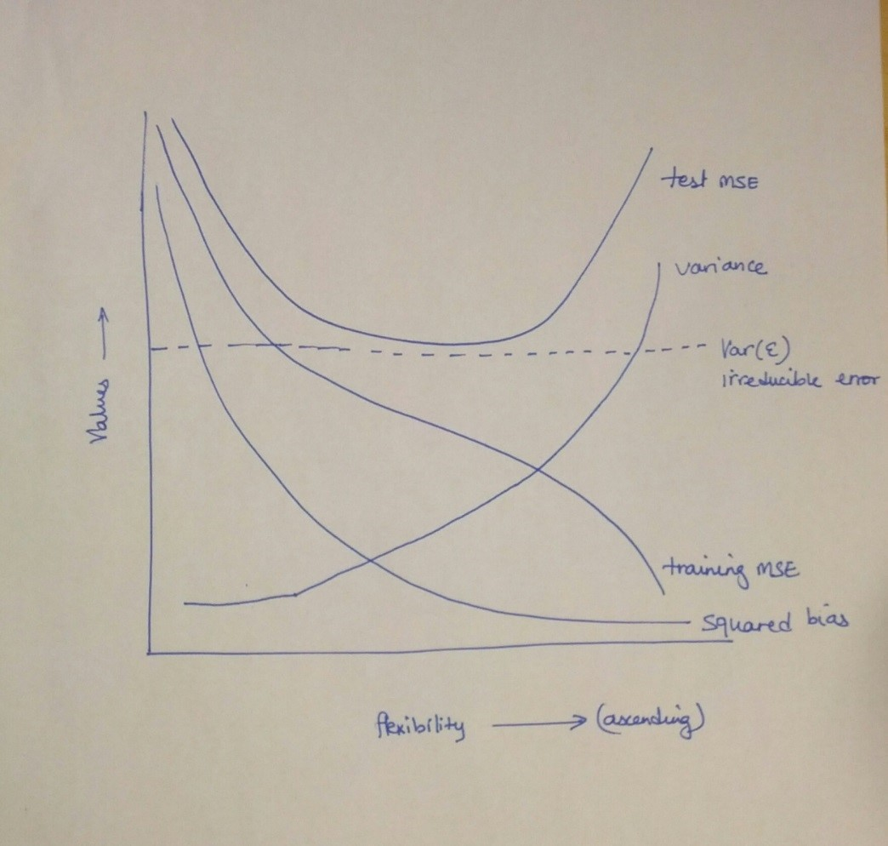
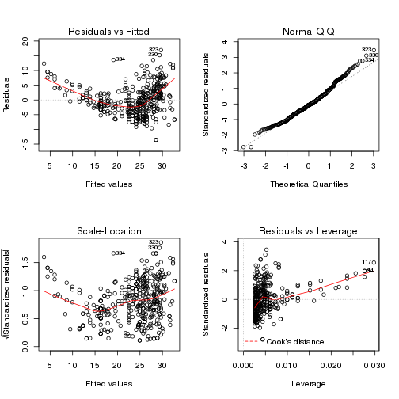

Solutions of the exercises from Chapter 2
============================================

## Conceptual

Q1. For each of parts (a) through (d), indicate whether i. or ii. is correct, and explain your answer. In general, do we expect the performance of a flexible statistical learning method to perform better or worse than an inflexible method when :
(a) The sample size $n$ is extremely large, and the number of predictors $p$ is small ?

*Inflexible*

(b) The number of predictors $p$ is extremely large, and the number of observations $n$ is small ?

*Inflexible*

(c) The relationship between the predictors and response is highly non-linear ?

*Flexible*

(d) The variance of the error terms, i.e. $\sigma^2 = Var(\varepsilon)$, is extremely high ?

*Flexible*

Q2. Explain whether each scenario is a classification or regression problem, and indicate whether we are most interested in inference or prediction. Finally, provide $n$ and $p$.

(a) We collect a set of data on the top 500 firms in the US. For each firm we record profit, number of employees, industry and the CEO salary. We are interested in understanding which factors affect CEO salary.

*Regression with $n = 500$ and $p = 3$*

(b) We are considering launching a new product and wish to know whether it will be a success or a failure. We collect data on 20 similar products that were previously launched. For each product we have recorded whether it was a success or failure, price charged for the product, marketing budget, competition price, and ten other variables.

*Classification with $n = 20$ and $p=13$*

(c) We are interesting in predicting the % change in the US dollar in relation to the weekly changes in the world stock markets. Hence we collect weekly data for all of 2012. For each week we record the % change in the dollar, the % change in the US market, the % change in the British market, and the % change in the German market.

*Regression with $n = 52$ and $p = 3$*

Q3. We now revisit the bias-variance decomposition.

(a) Provide a sketch of typical (squared) bias, variance, training error, test error, and Bayes (or irreducible) error curves, on a single plot, as we go from less flexible statistical learning methods towards more flexible approaches. The x-axis should represent the amount of flexibility in the method, and the y-axis should represent the values for each curve. There should be five curves. Make sure to label each one.



(b) Explain why each of the five curves has the shape displayed in part (a).

*The training MSE declines monotonically as flexibility increases, this is because as flexibility increases the $f$ curve fits the observed data more closely. The test MSE intially declines as flexibility increases but at some point it levels off and then starts to increase again (U-shape), this is because when a $f$ curve yields a small training MSE but a large test MSE we are actually overfitting the data (our procedure tries too hard to find patterns in the training data that are maybe only caused by chance rather than by true properties of the unknown $f$). The squared bias decreases monotonically and the variance increases monotonically; as a general rule, as we use more flexible methods, the variance will increase and the bias will decrease. Variance refers to the amount by wich $\hat{f}$ would change if we estimated it using a different training data set, so if the curve fits the observations very closely, changing any point may cause $\hat{f}$ to change considerably, and so will result in some variance. Bias refers to the error that is introduced by approximating a real-life problem by a much simpler model, so if we use a very simple model (linear regression) it is unlikely that any real-life problem has such a simple linear relationship, and so performing linear regression will result in some bias in the estimate of $f$. The irreducible error is a constant so it is a parallel line, this curve lies below the test MSE curve because the expected test MSE will always be greater the $Var(\varepsilon)$ (see relation $(2.7)$).*

Q4. You will now think of some real-life applications for statistical learning.

(a) Describe three real-life applications in which classification might be useful. Describe the response, as well as the predictors. Is the goal of each application inference or prediction ? Explain your answer.

*Classification 1 – Is this TV series/movie/ad campaign going to be successful or not (Response : Success/Failure, Predictors : Money spent, Talent, Running Time, Producer, TV Channel, Air time slot, etc., Goal : Prediction). Classification 2 – Should this applicant be admitted into Harvard University or not (Response :  Admit/Not admit, Predictors : SAT Scores, GPA, Socio Economic Strata, Income of parents, Essay effectiveness, Potential, etc., Goal : Prediction). Classification 3 – Salk Polio vaccine trials – Successful/Not Successful (Response : Did the child get polio or not, Predictors : Age, Geography, General health condition, Control/Test group, etc., Goal : Prediction).*

(b) Describe three real-life applications in which regression might be useful. Describe the response, as well as the predictors. Is the goal of each application inference or prediction ? Explain your answer.

*Regression 1 – GDP Growth in European economies (Response : What is the GDP of countries predicted to be by 2050, Predictors : Population, Per capita income, Education, Average life expectancy, Tax Revenue, Government Spending etc., Goal : Inference).  Regression 2 – What is the average house sale price in XXX neighborhood over the next 5 years (Response : Average house in XXX neighborhood will sell for Y next year, Z the year after, T after that, etc., Predictors : Proximity to transit, Parks, Schools, Average size of family, Average Income of Family, Crime Rate, Price Flux in surrounding neighborhoods etc., Goal : Inference). Regression 3 – Gas mileage that a new car design will result in (Response : With certain parameters being set, X is the mileage we will get out of this car, Predictors: Fuel type, Number of Cylinders, Engine Version, etc., Goal : Inference).*

(c) Describe three real-life applications in which cluster analysis might be useful.

*Cluster 1 – Division of countries into Developed, Developing and Third World (Response : By 2050, countries in Asia can be split into these following clusters, Predictors : Per Capita Income, Purchasing power parity, Average birth rate, Average number of years of education received, Average Death Rate, Population etc.,
Goal: Prediction). Cluster 2 – Division of average working population into income segments for taxation purposes (Response : This worker falls under this taxation bracket, Predictors : Income, Job Industry, Job Segment, Size of Company, etc., Goal : Prediction). Cluster 3 – Cluster new movies being produced into ratings G/PG/R/PG-13 etc. (Response : This movie is a R/PG/PG-13, 
Predictors : Violent content, Sexual language, theme, etc., 
Goal : Prediction).*

Q5. What are the advantages and disadvantages of a very flexible (versus a less flexible) approach for regression or classification ? Under what circumstances might a more flexible approach be preferred to a less flexible approach? When might a less flexible approach be preferred ?

\textit{
\begin{center}
\begin{tabular}{l|l}
\textsl{More flexible} &\textsl{Less flexible} \cr
\hline
\hline
\parbox[t]{5cm}{More interpretable model (inference).} &\parbox[t]{5cm}{Less interpretable model (inference).} \cr
\hline
\parbox[t]{5cm}{May not yield accurate predictions.} &\parbox[t]{5cm}{Quite accurate predictions (but beware of overfitting).} \cr
\hline
\parbox[t]{5cm}{If $f$ is linear then linear regression may have no bias.} &\parbox[t]{5cm}{If $f$ is highly nonlinear and we have a lot of observations then a nonlinear model may work very well.}
\end{tabular}
\end{center}
}

Q6. Describe the differences between a parametric and a non-parametric statistical learning approach. What are the advantages of a parametric approach to regression or classification (as opposed to a nonparametric approach) ? What are its disadvantages ?

\textit{
\begin{center}
\begin{tabular}{l|l}
\textsl{Parametric} &\textsl{Non-parametric} \cr
\hline
\hline
\parbox[t]{5cm}{Reduces the problem of estimating $f$ to estimating a set of parameters.} &\parbox[t]{5cm}{Seek an estimate of $f$ that gets as close to the data points as possible without being too rough or wiggly.} \cr
\hline
\parbox[t]{5cm}{Simplifies the problem because it is generally easier to estimate a set of parameters than to fit an entirely arbitrary function.} &\parbox[t]{5cm}{May accurately fit a wider range of possible shapes for $f$.} \cr
\hline
\parbox[t]{5cm}{If we use more flexible models it may lead to overfitting the data.} &\parbox[t]{5cm}{A very large number of observations is required to obtain an accurate estimate fro $f$.}
\end{tabular}
\end{center}
}

Q7. The table below provides a training data set containing 6 observations, 3 predictors, and 1 qualitative response variable. Suppose we wish to use this data set to make a prediction for Y when X1 = X2 = X3 = 0 using K-nearest neighbors.
(a) Compute the Euclidean distance between each observation and
the test point, X1 = X2 = X3 = 0.

\[
\begin{array}{|c|c|c|c|c|c|}
\hline
\mathrm{Obs.} &X_1 &X_2 &X_3 &Y &\mathrm{Distance} \cr
\hline
1 &0 &3 &0 &\mathrm{Red} &3 \cr
2 &2 &0 &0 &\mathrm{Red} &2 \cr
3 &0 &1 &3 &\mathrm{Red} &3.16 \cr
4 &0 &1 &2 &\mathrm{Green} &2.23 \cr
5 &-1 &0 &1 &\mathrm{Green} &1.41 \cr
6 &1 &1 &1 &\mathrm{Red} &1.73\cr
\hline
\end{array}
\]

(b) What is our prediction with $K = 1$ ? Why ?

*If $K = 1$ then $x_5\in\mathcal{N}_0$ and we have
\[P(Y = \mathrm{Red} | X = x_0) = \frac{1}{1}\sum_{i\in\mathcal{N}_0}I(y_i = \mathrm{Red}) = I(y_5 = \mathrm{Red}) = 0\]
and
\[P(Y = \mathrm{Green} | X = x_0) = \frac{1}{1}\sum_{i\in\mathcal{N}_0}I(y_i = \mathrm{Green}) = I(y_5 = \mathrm{Green}) = 1.\]
Our prediction is then Green.*

(c) What is our prediction with $K = 3$ ? Why ?

*If $K = 3$ then $x_2,x_5,x_6\in\mathcal{N}_0$ and we have
\[P(Y = \mathrm{Red} | X = x_0) = \frac{1}{3}\sum_{i\in\mathcal{N}_0}I(y_i = \mathrm{Red}) = \frac{1}{3}(1 + 0 + 1) = \frac{2}{3}\]
and
\[P(Y = \mathrm{Green} | X = x_0) = \frac{1}{3}\sum_{i\in\mathcal{N}_0}I(y_i = \mathrm{Green}) = \frac{1}{3}(0 + 1 + 0) = \frac{1}{3}.\]
Our prediction is then Red.*

(d) If the Bayes decision boundary in this problem is highly nonlinear, then would we expect the best value for $K$ to be large or small ? Why ?

*As $K$ becomes larger, the boundary becomes smoother. So in this case we would expect the best value for $K$ to be small.*

## Applied

Q8. This exercise relates to the "College" data set, which can be found in the file "College.csv". It contains a number of variables for 777 different universities and colleges in the US.

(a) Use the read.csv() function to read the data into R. Call the loaded data "college". Make sure that you have the directory set to the correct location for the data.


```r
library(ISLR)
data(College)
college <- read.csv("College.csv")
```

(b) Look at the data using the fix() function. You should notice that the first column is just the name of each university. We don't really want R to treat this as data. However, it may be handy to have these names for later.


```r
head(college[, 1:5])
```

```
##                              X Private Apps Accept Enroll
## 1 Abilene Christian University     Yes 1660   1232    721
## 2           Adelphi University     Yes 2186   1924    512
## 3               Adrian College     Yes 1428   1097    336
## 4          Agnes Scott College     Yes  417    349    137
## 5    Alaska Pacific University     Yes  193    146     55
## 6            Albertson College     Yes  587    479    158
```

```r
rownames <- college[, 1]
college <- college[, -1]
head(college[, 1:5])
```

```
##   Private Apps Accept Enroll Top10perc
## 1     Yes 1660   1232    721        23
## 2     Yes 2186   1924    512        16
## 3     Yes 1428   1097    336        22
## 4     Yes  417    349    137        60
## 5     Yes  193    146     55        16
## 6     Yes  587    479    158        38
```

(c) Use the summary() function to produce a numerical summary of the variables in the data set.


```r
summary(college)
```

```
##  Private        Apps           Accept          Enroll       Top10perc   
##  No :212   Min.   :   81   Min.   :   72   Min.   :  35   Min.   : 1.0  
##  Yes:565   1st Qu.:  776   1st Qu.:  604   1st Qu.: 242   1st Qu.:15.0  
##            Median : 1558   Median : 1110   Median : 434   Median :23.0  
##            Mean   : 3002   Mean   : 2019   Mean   : 780   Mean   :27.6  
##            3rd Qu.: 3624   3rd Qu.: 2424   3rd Qu.: 902   3rd Qu.:35.0  
##            Max.   :48094   Max.   :26330   Max.   :6392   Max.   :96.0  
##    Top25perc      F.Undergrad     P.Undergrad       Outstate    
##  Min.   :  9.0   Min.   :  139   Min.   :    1   Min.   : 2340  
##  1st Qu.: 41.0   1st Qu.:  992   1st Qu.:   95   1st Qu.: 7320  
##  Median : 54.0   Median : 1707   Median :  353   Median : 9990  
##  Mean   : 55.8   Mean   : 3700   Mean   :  855   Mean   :10441  
##  3rd Qu.: 69.0   3rd Qu.: 4005   3rd Qu.:  967   3rd Qu.:12925  
##  Max.   :100.0   Max.   :31643   Max.   :21836   Max.   :21700  
##    Room.Board       Books         Personal         PhD       
##  Min.   :1780   Min.   :  96   Min.   : 250   Min.   :  8.0  
##  1st Qu.:3597   1st Qu.: 470   1st Qu.: 850   1st Qu.: 62.0  
##  Median :4200   Median : 500   Median :1200   Median : 75.0  
##  Mean   :4358   Mean   : 549   Mean   :1341   Mean   : 72.7  
##  3rd Qu.:5050   3rd Qu.: 600   3rd Qu.:1700   3rd Qu.: 85.0  
##  Max.   :8124   Max.   :2340   Max.   :6800   Max.   :103.0  
##     Terminal       S.F.Ratio     perc.alumni       Expend     
##  Min.   : 24.0   Min.   : 2.5   Min.   : 0.0   Min.   : 3186  
##  1st Qu.: 71.0   1st Qu.:11.5   1st Qu.:13.0   1st Qu.: 6751  
##  Median : 82.0   Median :13.6   Median :21.0   Median : 8377  
##  Mean   : 79.7   Mean   :14.1   Mean   :22.7   Mean   : 9660  
##  3rd Qu.: 92.0   3rd Qu.:16.5   3rd Qu.:31.0   3rd Qu.:10830  
##  Max.   :100.0   Max.   :39.8   Max.   :64.0   Max.   :56233  
##    Grad.Rate    
##  Min.   : 10.0  
##  1st Qu.: 53.0  
##  Median : 65.0  
##  Mean   : 65.5  
##  3rd Qu.: 78.0  
##  Max.   :118.0
```

Use the pairs() function to produce a scatterplot matrix of the first ten columns or variables of the data.


```r
pairs(college[, 1:10])
```

 

Use the plot() function to produce side-by-side boxplots of "Outstate" versus "Private".


```r
plot(college$Private, college$Outstate, xlab = "Private University", ylab ="Out of State tuition in USD", main = "Outstate Tuition Plot")
```

 

Create a new qualitative variable, called "Elite", by binning the "Top10perc" variable. Use the summary() function to see how many elite universities there are. Now use the plot() function to produce side-by-side boxplots of "Outstate" versus "Elite".


```r
Elite <- rep("No", nrow(college))
Elite[college$Top10perc > 50] <- "Yes"
Elite <- as.factor(Elite)
college$Elite <- Elite
summary(college$Elite)
```

```
##  No Yes 
## 699  78
```

```r
plot(college$Elite, college$Outstate, xlab = "Elite University", ylab ="Out of State tuition in USD", main = "Outstate Tuition Plot")
```

 

Use the hist() function to produce some histograms with numbers of bins for a few of the quantitative variables.


```r
par(mfrow = c(2,2))
hist(college$Books, col = 2, xlab = "Books", ylab = "Count")
hist(college$PhD, col = 3, xlab = "PhD", ylab = "Count")
hist(college$Grad.Rate, col = 4, xlab = "Grad Rate", ylab = "Count")
hist(college$perc.alumni, col = 6, xlab = "% alumni", ylab = "Count")
```

 

Continue exploring the data, and provide a brief summary of what you discover.


```r
summary(college$PhD)
```

```
##    Min. 1st Qu.  Median    Mean 3rd Qu.    Max. 
##     8.0    62.0    75.0    72.7    85.0   103.0
```

*It is a little weird to have universities with $103\%$ of faculty with Phd's, let us see how many universities have this percentage and their names.*


```r
weird.phd <- college[college$PhD == 103, ]
nrow(weird.phd)
```

```
## [1] 1
```

```r
rownames[as.numeric(rownames(weird.phd))]
```

```
## [1] Texas A&M University at Galveston
## 777 Levels: Abilene Christian University ... York College of Pennsylvania
```

Q9. This exercise involves the "Auto" data set studied in the lab. Make sure the missing values have been removed from the data.

(a) Which of the predictors are quantitative, and which are qualitative ?


```r
auto <- read.csv("Auto.csv", na.strings = "?")
auto <- na.omit(auto)
str(auto)
```

```
## 'data.frame':	392 obs. of  9 variables:
##  $ mpg         : num  18 15 18 16 17 15 14 14 14 15 ...
##  $ cylinders   : int  8 8 8 8 8 8 8 8 8 8 ...
##  $ displacement: num  307 350 318 304 302 429 454 440 455 390 ...
##  $ horsepower  : int  130 165 150 150 140 198 220 215 225 190 ...
##  $ weight      : int  3504 3693 3436 3433 3449 4341 4354 4312 4425 3850 ...
##  $ acceleration: num  12 11.5 11 12 10.5 10 9 8.5 10 8.5 ...
##  $ year        : int  70 70 70 70 70 70 70 70 70 70 ...
##  $ origin      : int  1 1 1 1 1 1 1 1 1 1 ...
##  $ name        : Factor w/ 304 levels "amc ambassador brougham",..: 49 36 231 14 161 141 54 223 241 2 ...
##  - attr(*, "na.action")=Class 'omit'  Named int [1:5] 33 127 331 337 355
##   .. ..- attr(*, "names")= chr [1:5] "33" "127" "331" "337" ...
```

*All variables except "horsepower" and "name" are quantitative.*

(b) What is the range of each quantitative predictor ?


```r
summary(auto[, -c(4, 9)])
```

```
##       mpg         cylinders     displacement     weight      acceleration 
##  Min.   : 9.0   Min.   :3.00   Min.   : 68   Min.   :1613   Min.   : 8.0  
##  1st Qu.:17.0   1st Qu.:4.00   1st Qu.:105   1st Qu.:2225   1st Qu.:13.8  
##  Median :22.8   Median :4.00   Median :151   Median :2804   Median :15.5  
##  Mean   :23.4   Mean   :5.47   Mean   :194   Mean   :2978   Mean   :15.5  
##  3rd Qu.:29.0   3rd Qu.:8.00   3rd Qu.:276   3rd Qu.:3615   3rd Qu.:17.0  
##  Max.   :46.6   Max.   :8.00   Max.   :455   Max.   :5140   Max.   :24.8  
##       year        origin    
##  Min.   :70   Min.   :1.00  
##  1st Qu.:73   1st Qu.:1.00  
##  Median :76   Median :1.00  
##  Mean   :76   Mean   :1.58  
##  3rd Qu.:79   3rd Qu.:2.00  
##  Max.   :82   Max.   :3.00
```

(c) What is the mean and standard deviation of each quantitative predictor ?


```r
sapply(auto[, -c(4, 9)], mean)
```

```
##          mpg    cylinders displacement       weight acceleration 
##       23.446        5.472      194.412     2977.584       15.541 
##         year       origin 
##       75.980        1.577
```

```r
sapply(auto[, -c(4, 9)], sd)
```

```
##          mpg    cylinders displacement       weight acceleration 
##       7.8050       1.7058     104.6440     849.4026       2.7589 
##         year       origin 
##       3.6837       0.8055
```

(d) Now remove the 10th through 85th observations. What is the range, mean, and standard deviation of each predictor in the subset of the data that remains ?


```r
subset <- auto[-c(10:85), -c(4,9)]
sapply(subset, range)
```

```
##       mpg cylinders displacement weight acceleration year origin
## [1,] 11.0         3           68   1649          8.5   70      1
## [2,] 46.6         8          455   4997         24.8   82      3
```

```r
sapply(subset, mean)
```

```
##          mpg    cylinders displacement       weight acceleration 
##       24.404        5.373      187.241     2935.972       15.727 
##         year       origin 
##       77.146        1.601
```

```r
sapply(subset, sd)
```

```
##          mpg    cylinders displacement       weight acceleration 
##       7.8673       1.6542      99.6784     811.3002       2.6937 
##         year       origin 
##       3.1062       0.8199
```

(e) Using the full data set, investigate the predictors graphically, using scatterplots or other tools of your choice. Create some plots highlighting the relationships among the predictors. Comment on your findings.


```r
auto$cylinders <- as.factor(auto$cylinders)
auto$year <- as.factor(auto$year)
auto$origin <- as.factor(auto$origin)
pairs(auto)
```

 

*We seem to get more mileage per gallon on a 4 cyl vehicle than the others. Weight, displacement and horsepower seem to have an inverse effect with mpg. We see an overall increase in mpg over the years. Almost doubled in one decade. Japanese cars have higher mpg than US or European cars.*

(f) Suppose that we wish to predict gas mileage ("mpg") on the basis of other variables. Do your plots suggest that any of the other variables might be useful in predicting "mpg" ?

*From the plots above, the cylinders, horsepower, year and origin can be used as predictors. Displacement and weight were not used because they are highly correlated with horespower and with each other.*


```r
auto$horsepower <- as.numeric(auto$horsepower)
cor(auto$weight, auto$horsepower)
```

```
## [1] 0.8645
```

```r
cor(auto$weight, auto$displacement)
```

```
## [1] 0.933
```

```r
cor(auto$displacement, auto$horsepower)
```

```
## [1] 0.8973
```

Q10. This exercise involves the "Boston" housing data set.

(a) To begin, load in the "Boston" data set.


```r
library(MASS)
Boston$chas <- as.factor(Boston$chas)
nrow(Boston)
```

```
## [1] 506
```

```r
ncol(Boston)
```

```
## [1] 14
```

(b) Make some pairwise scatterplots of the predictors in this data set.


```r
par(mfrow = c(2, 2))
plot(Boston$nox, Boston$crim)
plot(Boston$rm, Boston$crim)
plot(Boston$age, Boston$crim)
plot(Boston$dis, Boston$crim)
```

 

(c) Are any of the predictors associated with per capita crime rate ?


```r
hist(Boston$crim, breaks = 50)
```

 

*Most suburbs do not have any crime ($80\%$ of data falls in crim < 20).*


```r
pairs(Boston[Boston$crim < 20, ])
```

 

*There may be a relationship between crim and nox, rm, age, dis, lstat and medv.*

(d) Do any of the suburbs of Boston appear to have particularly high crime rates ? Tax rates ? Pupil-teacher ratios ?


```r
hist(Boston$crim, breaks = 50)
```

 

```r
nrow(Boston[Boston$crim > 20, ])
```

```
## [1] 18
```

```r
hist(Boston$tax, breaks = 50)
```

 

```r
nrow(Boston[Boston$tax == 666, ])
```

```
## [1] 132
```

```r
hist(Boston$ptratio, breaks = 50)
```

 

```r
nrow(Boston[Boston$ptratio > 20, ])
```

```
## [1] 201
```

(e) How many of the suburbs in this data set bound the Charles river ?


```r
nrow(Boston[Boston$chas == 1, ])
```

```
## [1] 35
```

(f) What is the median pupil-teacher ratio among the towns in this data set ?


```r
median(Boston$ptratio)
```

```
## [1] 19.05
```

(g) Which suburb of Boston has lowest median value of owner-occupied homes ? What are the values of the other predictors for that suburb, and how do those values compare to the overall ranges for those predictors ?


```r
row.names(Boston[min(Boston$medv), ])
```

```
## [1] "5"
```

```r
range(Boston$tax)
```

```
## [1] 187 711
```

```r
Boston[min(Boston$medv), ]$tax
```

```
## [1] 222
```

(h) In this data set, how many of the suburbs average more than seven rooms per dwelling ? More than eight rooms per dwelling ?


```r
nrow(Boston[Boston$rm > 7, ])
```

```
## [1] 64
```

```r
nrow(Boston[Boston$rm > 8, ])
```

```
## [1] 13
```
