Solutions of the exercises from Chapter 3
============================================

## Conceptual

**Q1.** Describe the null hypotheses to which the p-values given in Table 3.4 correspond. Explain what conclusions you can draw based on these p-values. Your explanation should be phrased in terms of sales, TV, radio, and newspaper, rather than in terms of the coefficients of the linear model.

*The null hypotheses associated with table 3.4 are that advertising budgets of "TV", "radio" or "newspaper" do not have an effect on sales. More precisely $H_0^{(1)} : \beta_1 = 0$, $H_0^{(2)} : \beta_2 = 0$ and $H_0^{(3)} : \beta_3 = 0$. The corresponding p-values are highly significant for "TV" and "radio" and not significant for "newspaper"; so we reject $H_0^{(1)}$ and $H_0^{(2)}$ and we do not reject $H_0^{(3)}$. We may conclude that newspaper advertising budget do not affect sales.*

**Q2.** Carefully explain the differences between the KNN classifier and KNN regression methods.

*The KNN classifier is typically used to solve classification problems (those with a qualitative response) by identifying the neighborhood of $x_0$ and then estimating the conditional probability $P(Y = j | X = x_0)$ for class $j$ as the fraction of points in the neighborhood whose response values equal $j$. The KNN regression method is used to solve regression problems (those with a quantitative response) by again identifying the neighborhood of $x_0$ and then estimating $f(x_0)$ as the average of all the training responses in the neighborhood.*

**Q3.** Suppose we have a data set with five predictors, $X1 = \mathrm{GPA}$, $X2 = \mathrm{IQ}$, $X3 = \mathrm{Gender}$ (1 for Female and 0 for Male), $X4 = \mathrm{Interaction\ between\ GPA\ and\ IQ}$, and $X5 = \mathrm{Interaction\ between\ GPA\ and\ Gender}$. The response is starting salary after graduation (in thousands of dollars). Suppose we use least squares to fit the model, and get $\hat{\beta_0} = 50$, $\hat{\beta_1} = 20$, $\hat{\beta_2} = 0.07$, $\hat{\beta_3} = 35$, $\hat{\beta_4} = 0.01$, $\hat{\beta_5} = -10$.

(a) Which answer is correct, and why?

i. For a fixed value of IQ and GPA, males earn more on average than females.
ii. For a fixed value of IQ and GPA, females earn more on average than males.
iii. For a fixed value of IQ and GPA, males earn more on average than females provided that the GPA is high enough.
iv. For a fixed value of IQ and GPA, females earn more on average than males provided that the GPA is high enough.

*The least square line is given by
\[\hat{y} = 50 + 20GPA + 0.07IQ + 35Gender + 0.01GPA\times IQ - 10GPA\times Gender\]
which becomes for the males
\[\hat{y} = 50 + 20GPA + 0.07IQ + 0.01GPA\times IQ,\]
and for the females
\[\hat{y} = 85 + 10GPA + 0.07IQ + 0.01GPA\times IQ.\]
So the starting salary for males is higher than for females on average iff $50 + 20GPA\ge 85 + 10GPA$ which is equivalent to $GPA\ge 3.5$. Therefore iii. is the right answer.*

(b) Predict the salary of a female with IQ of 110 and a GPA of 4.0.

*It suffices to plug in the given values in the least square line for females given above and we obtain
\[\hat{y} = 85 + 40 + 7.7 + 4.4 = 137.1,\]
which gives us a starting salary of $137100\$$.*

(c) True or false: Since the coefficient for the GPA/IQ interaction term is very small, there is very little evidence of an interaction effect. Justify your answer.

*False. To verify if the GPA/IQ has an impact on the quality of the model we need to test the hypothesis $H_0 : \hat{\beta_4} = 0$ and look at the p-value associated with the $t$ or the $F$ statistic to draw a conclusion.*

**Q4.** I collect a set of data ($n = 100$ observations) containing a single predictor and a quantitative response. I then fit a linear regression model to the data, as well as a separate cubic regression, i.e. $Y = \beta_0 + \beta_1 X + \beta_2 X^2 + \beta_3 X^3 + \varepsilon$ .

(a) Suppose that the true relationship between $X$ and $Y$ is linear, i.e. $Y = \beta_0 + \beta_1 X + \varepsilon$. Consider the training residual sum of squares (RSS) for the linear regression, and also the training RSS for the cubic regression. Would we expect one to be lower than the other, would we expect them to be the same, or is there not enough information to tell? Justify your answer.

*Without knowing more details about the training data, it is difficult to know which training RSS is lower between linear or cubic. However, as the true relationship between $X$ and $Y$ is linear, we may expect the least squares line to be close to the true regression line, and consequently the RSS for the linear regression may be lower than for the cubic regression.*

(b) Answer (a) using test rather than training RSS.

*In this case the test RSS depends upon the test data, so we have not enough information to conclude.*

(c) Suppose that the true relationship between X and Y is not linear, but we don’t know how far it is from linear. Consider the training RSS for the linear regression, and also the training RSS for the cubic regression. Would we expect one to be lower than the other, would we expect them to be the same, or is there not enough information to tell? Justify your answer.

*Here also, there is not enough information to tell. If the actual data is pretty linear, then a linear regression may yield better results than a cubic regression. However, if the actual data is more cubic, then cubic regression may be the better option. Whichever one is the better option will yield lower RSS than the other.*

(d) Answer (c) using test rather than training RSS.

*See answer for (c). above.*

**Q5.** Consider the fitted values that result from performing linear regression without an intercept. In this setting, the i-th fitted value takes the form $\hat{y_i} = x_i\hat{\beta}$, where
\[\hat{\beta} = \frac{\sum_{i=1}^n x_iy_i}{\sum_{k=1}^nx_k^2}.\]
Show that we can write
\[\hat{y}_i = \sum_{j=1}^na_jy_j.\]
What is $a_j$ ?

*We have immediately that
\[\hat{y}_i = x_i\frac{\sum_{j=1}^n x_jy_j}{\sum_{k=1}^nx_k^2} = \sum_{j=1}^n\frac{x_ix_j}{\sum_{k=1}^nx_k^2}y_j = \sum_{j=1}^na_jy_j.\]*

**Q6.** Using (3.4), argue that in the case of simple linear regression, the least squares line always passes through the point $(\overline{x},\overline{y})$.

*The least square line equation is $y = \hat{\beta}_0 + \hat{\beta}_1x$, so if we substitute $\overline{x}$ for $x$ we obtain
\[y = \hat{\beta}_0 + \hat{\beta}_1\overline{x} = \overline{y} - \hat{\beta}_1\overline{x} + \hat{\beta}_1\overline{x} = \overline{y}.\]
We may conclude that the least square line passes through the point $(\overline{x},\overline{y})$.*

**Q7.** It is claimed in the text that in the case of simple linear regression of $Y$ onto $X$, the $R^2$ statistic (3.17) is equal to the square of the correlation between $X$ and $Y$ (3.18). Prove that this is the case. For simplicity, you may assume that $\overline{x} = \overline{y} = 0$.

*We have the following equalities
\[R^2 = 1 - \frac{RSS}{TSS} = 1 - \frac{\sum_i(y_i - \hat{y}_i)^2}{\sum_jy_j^2};\]
with $\hat{y}_i = \hat{\beta}_1x_i$ we may write
\[R^2 = 1 - \frac{\sum_i(y_i - \sum_jx_jy_j/\sum_jx_j^2 x_i)^2}{\sum_jy_j^2} = \frac{\sum_jy_j^2 - (\sum_iy_i^2 - 2\sum_iy_i(\sum_jx_jy_j/\sum_jx_j^2)x_i + \sum_i(\sum_jx_jy_j/\sum_jx_j^2)^2x_i^2)}{\sum_jy_j^2}\]
and finally
\[R^2 = \frac{2(\sum_ix_iy_i)^2/\sum_jx_j^2 - (\sum_ix_iy_i)^2/\sum_jx_j^2}{\sum_jy_j^2} = \frac{(\sum_ix_iy_i)^2}{\sum_jx_j^2\sum_jy_j^2} = Cor(X, Y)^2.\]*

## Applied

**Q8.** This question involves the use of simple linear regression on the "Auto" data set.

(a) Use the lm() function to perform a simple linear regression with "mpg" as the response and "horsepower" as the predictor. Use the summary() function to print the results. Comment on the output. For example :

i. Is there a relationship between the predictor and the response ?


```r
library(ISLR)
data(Auto)
fit <- lm(mpg ~ horsepower, data = Auto)
summary(fit)
```

```
## 
## Call:
## lm(formula = mpg ~ horsepower, data = Auto)
## 
## Residuals:
##     Min      1Q  Median      3Q     Max 
## -13.571  -3.259  -0.344   2.763  16.924 
## 
## Coefficients:
##             Estimate Std. Error t value Pr(>|t|)    
## (Intercept) 39.93586    0.71750    55.7   <2e-16 ***
## horsepower  -0.15784    0.00645   -24.5   <2e-16 ***
## ---
## Signif. codes:  0 '***' 0.001 '**' 0.01 '*' 0.05 '.' 0.1 ' ' 1
## 
## Residual standard error: 4.91 on 390 degrees of freedom
## Multiple R-squared:  0.606,	Adjusted R-squared:  0.605 
## F-statistic:  600 on 1 and 390 DF,  p-value: <2e-16
```

*We can answer this question by testing the hypothesis $H_0 : \beta_i = 0\ \forall i$. The p-value corresponding to the F-statistic is 7.032 &times; 10<sup>-81</sup>, this indicates a clear evidence of a relationship between "mpg" and "horsepower".*

ii. How strong is the relationship between the predictor and the response ?

*We may note that as the $R^2$ is equal to 0.6059, almost 60.5948% of the variability in "mpg" can be explained using "horsepower".*

iii. Is the relationship between the predictor and the response positive or negative ?

*As the coeficient of "horsepower" is negative, the relationship is also negative.*

iv. What is the predicted $mpg$ associated with a "horsepower" of 98 ? What are the associated 95% confidence and prediction intervals ?


```r
predict(fit, data.frame(horsepower = 98), interval = "confidence")
```

```
##     fit   lwr   upr
## 1 24.47 23.97 24.96
```

(b) Plot the response and the predictor. Use the abline() function to display the least squares regression line.


```r
plot(Auto$horsepower, Auto$mpg, main = "Scatterplot of mpg vs. horsepower", xlab = "horsepower", ylab = "mpg", col = "blue")
abline(fit, col = "red")
```

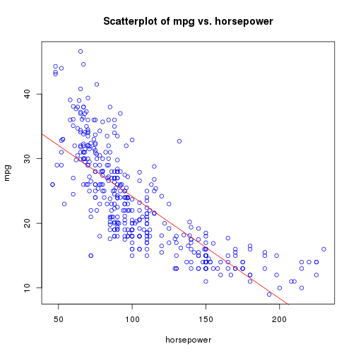 

(c) Use the plot() function to produce diagnostic plots of the least squares regression fit. Comment on any problems you see with the fit.


```r
par(mfrow = c(2, 2))
plot(fit)
```

 

*The plot of residuals versus fitted values indicates the presence of non linearity in the data. The plot of standardized residuals versus leverage indicates the presence of a few outliers (higher than 2 or lower than -2) and a few high leverage points.*

**Q9.** This question involves the use of multiple linear regression on the "Auto" data set.

(a) Produce a scatterplot matrix which include all the variables in the data set.


```r
pairs(Auto)
```

 

(b) Compute the matrix of correlations between the variables using the function cor(). You will need to exclude the "name" variable, which is qualitative.


```r
names(Auto)
```

```
## [1] "mpg"          "cylinders"    "displacement" "horsepower"  
## [5] "weight"       "acceleration" "year"         "origin"      
## [9] "name"
```

```r
cor(Auto[1:8])
```

```
##                  mpg cylinders displacement horsepower  weight
## mpg           1.0000   -0.7776      -0.8051    -0.7784 -0.8322
## cylinders    -0.7776    1.0000       0.9508     0.8430  0.8975
## displacement -0.8051    0.9508       1.0000     0.8973  0.9330
## horsepower   -0.7784    0.8430       0.8973     1.0000  0.8645
## weight       -0.8322    0.8975       0.9330     0.8645  1.0000
## acceleration  0.4233   -0.5047      -0.5438    -0.6892 -0.4168
## year          0.5805   -0.3456      -0.3699    -0.4164 -0.3091
## origin        0.5652   -0.5689      -0.6145    -0.4552 -0.5850
##              acceleration    year  origin
## mpg                0.4233  0.5805  0.5652
## cylinders         -0.5047 -0.3456 -0.5689
## displacement      -0.5438 -0.3699 -0.6145
## horsepower        -0.6892 -0.4164 -0.4552
## weight            -0.4168 -0.3091 -0.5850
## acceleration       1.0000  0.2903  0.2127
## year               0.2903  1.0000  0.1815
## origin             0.2127  0.1815  1.0000
```

(c) Use the lm() function to perform a multiple linear regression with "mpg" as the response and all other variables except "name" as the predictors. Use the summary() function to print the results. Comment on the output. For instance :

i. Is there a relationship between the predictors and the response ?


```r
fit2 <- lm(mpg ~ . - name, data = Auto)
summary(fit2)
```

```
## 
## Call:
## lm(formula = mpg ~ . - name, data = Auto)
## 
## Residuals:
##    Min     1Q Median     3Q    Max 
## -9.590 -2.157 -0.117  1.869 13.060 
## 
## Coefficients:
##               Estimate Std. Error t value Pr(>|t|)    
## (Intercept)  -1.72e+01   4.64e+00   -3.71  0.00024 ***
## cylinders    -4.93e-01   3.23e-01   -1.53  0.12780    
## displacement  1.99e-02   7.51e-03    2.65  0.00844 ** 
## horsepower   -1.70e-02   1.38e-02   -1.23  0.21963    
## weight       -6.47e-03   6.52e-04   -9.93  < 2e-16 ***
## acceleration  8.06e-02   9.88e-02    0.82  0.41548    
## year          7.51e-01   5.10e-02   14.73  < 2e-16 ***
## origin        1.43e+00   2.78e-01    5.13  4.7e-07 ***
## ---
## Signif. codes:  0 '***' 0.001 '**' 0.01 '*' 0.05 '.' 0.1 ' ' 1
## 
## Residual standard error: 3.33 on 384 degrees of freedom
## Multiple R-squared:  0.821,	Adjusted R-squared:  0.818 
## F-statistic:  252 on 7 and 384 DF,  p-value: <2e-16
```

*We can answer this question by again testing the hypothesis $H_0 : \beta_i = 0\ \forall i$. The p-value corresponding to the F-statistic is 2.0371 &times; 10<sup>-139</sup>, this indicates a clear evidence of a relationship between "mpg" and the other predictors.*

ii. Which predictors appear to have a statistically significant relationship to the response ?

*We can answer this question by checking the p-values associated with each predictor's t-statistic. We may conclude that all predictors are statistically significant except "cylinders", "horsepower" and "acceleration".*

iii. What does the coefficient for the "year" variable suggest ?

*The coefficient ot the "year" variable suggests that the average effect of an increase of 1 year is an increase of 0.7508 in "mpg" (all other predictors remaining constant).*

(d) Use the plot() function to produce diagnostic plots of the linear regression fit. Comment on any problems you see with the fit. Do the residual plots suggest any unusually large outliers ? Does the leverage plots identify any observations with unusually high leverages ?


```r
par(mfrow = c(2, 2))
plot(fit2)
```

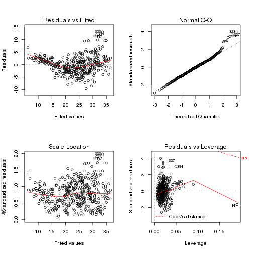 

*As before, the plot of residuals versus fitted values indicates the presence of mild non linearity in the data. The plot of standardized residuals versus leverage indicates the presence of a few outliers (higher than 2 or lower than -2) and one high leverage point.*

(e) Use the * and : symbols to fit linear regression models with interaction effects. Do any interactions appear to be statistically significant ?


```r
fit3 <- lm(mpg ~ .*., data = Auto[, 1:8])
summary(fit3)
```

```
## 
## Call:
## lm(formula = mpg ~ . * ., data = Auto[, 1:8])
## 
## Residuals:
##    Min     1Q Median     3Q    Max 
##  -7.63  -1.45   0.06   1.27  11.14 
## 
## Coefficients:
##                            Estimate Std. Error t value Pr(>|t|)   
## (Intercept)                3.55e+01   5.31e+01    0.67   0.5047   
## cylinders                  6.99e+00   8.25e+00    0.85   0.3974   
## displacement              -4.79e-01   1.89e-01   -2.53   0.0119 * 
## horsepower                 5.03e-01   3.47e-01    1.45   0.1477   
## weight                     4.13e-03   1.76e-02    0.23   0.8144   
## acceleration              -5.86e+00   2.17e+00   -2.70   0.0074 **
## year                       6.97e-01   6.10e-01    1.14   0.2534   
## origin                    -2.09e+01   7.10e+00   -2.94   0.0034 **
## cylinders:displacement    -3.38e-03   6.46e-03   -0.52   0.6005   
## cylinders:horsepower       1.16e-02   2.42e-02    0.48   0.6316   
## cylinders:weight           3.58e-04   8.96e-04    0.40   0.6900   
## cylinders:acceleration     2.78e-01   1.66e-01    1.67   0.0958 . 
## cylinders:year            -1.74e-01   9.71e-02   -1.79   0.0739 . 
## cylinders:origin           4.02e-01   4.93e-01    0.82   0.4148   
## displacement:horsepower   -8.49e-05   2.89e-04   -0.29   0.7687   
## displacement:weight        2.47e-05   1.47e-05    1.68   0.0934 . 
## displacement:acceleration -3.48e-03   3.34e-03   -1.04   0.2985   
## displacement:year          5.93e-03   2.39e-03    2.48   0.0135 * 
## displacement:origin        2.40e-02   1.95e-02    1.23   0.2187   
## horsepower:weight         -1.97e-05   2.92e-05   -0.67   0.5012   
## horsepower:acceleration   -7.21e-03   3.72e-03   -1.94   0.0533 . 
## horsepower:year           -5.84e-03   3.94e-03   -1.48   0.1392   
## horsepower:origin          2.23e-03   2.93e-02    0.08   0.9393   
## weight:acceleration        2.35e-04   2.29e-04    1.03   0.3060   
## weight:year               -2.25e-04   2.13e-04   -1.06   0.2918   
## weight:origin             -5.79e-04   1.59e-03   -0.36   0.7162   
## acceleration:year          5.56e-02   2.56e-02    2.17   0.0303 * 
## acceleration:origin        4.58e-01   1.57e-01    2.93   0.0037 **
## year:origin                1.39e-01   7.40e-02    1.88   0.0606 . 
## ---
## Signif. codes:  0 '***' 0.001 '**' 0.01 '*' 0.05 '.' 0.1 ' ' 1
## 
## Residual standard error: 2.69 on 363 degrees of freedom
## Multiple R-squared:  0.889,	Adjusted R-squared:  0.881 
## F-statistic:  104 on 28 and 363 DF,  p-value: <2e-16
```

*The interactions between "acceleration:origin", "acceleration:year" and "displacement:year" appear to be statistically significant.*

(f) Try a few different transformations of the variables, such as $\log{X}$, $\sqrt{X}$, $X^2$. Comment on your findings.


```r
par(mfrow = c(2, 2))
plot(log(Auto$horsepower), Auto$mpg)
plot(sqrt(Auto$horsepower), Auto$mpg)
plot((Auto$horsepower)^2, Auto$mpg)
```

 

*We limit ourselves to examining "horsepower" as sole predictor. It seems that the log transformation gives the most linear looking plot.*

**Q10.** This question should be answered using the "Carseats" data set.

(a) Fit a multiple regression model to predict "Sales" using "Price", "Urban" and "US".


```r
data(Carseats)
fit3 <- lm(Sales ~ Price + Urban + US, data = Carseats)
summary(fit3)
```

```
## 
## Call:
## lm(formula = Sales ~ Price + Urban + US, data = Carseats)
## 
## Residuals:
##    Min     1Q Median     3Q    Max 
## -6.921 -1.622 -0.056  1.579  7.058 
## 
## Coefficients:
##             Estimate Std. Error t value Pr(>|t|)    
## (Intercept) 13.04347    0.65101   20.04  < 2e-16 ***
## Price       -0.05446    0.00524  -10.39  < 2e-16 ***
## UrbanYes    -0.02192    0.27165   -0.08     0.94    
## USYes        1.20057    0.25904    4.63  4.9e-06 ***
## ---
## Signif. codes:  0 '***' 0.001 '**' 0.01 '*' 0.05 '.' 0.1 ' ' 1
## 
## Residual standard error: 2.47 on 396 degrees of freedom
## Multiple R-squared:  0.239,	Adjusted R-squared:  0.234 
## F-statistic: 41.5 on 3 and 396 DF,  p-value: <2e-16
```

(b) Provide an interpretation of each coefficient in the model. Be careful - some of the variables in the model are qualitative !

*The coefficient of the "Price" variable may be interpreted by saying that the average effect of a price increase of 1 dollar is a decrease of 54.4588 units in sales all other predictors remaining fixed. The coefficient of the "Urban" variable may be interpreted by saying that on average the unit sales in urban location are 21.9162 units less than in rural location all other predictors remaining fixed. The coefficient of the "US" variable may be interpreted by saying that on average the unit sales in a US store are 1200.5727 units more than in a non US store all other predictors remaining fixed.*

(c) Write out the model in equation form, being careful to handle the qualitative variables properly.

*The model may be written as
\[Sales = 13.0435 + (-0.0545)\times Price + (-0.0219)\times Urban + (1.2006)\times US + \varepsilon\]
with $Urban = 1$ if the store is in an urban location and $0$ if not, and $US = 1$ if the store is in the US and $0$ if not.*

(d) For which of the predictors can you reject the null hypothesis $H_0 : \beta_j = 0$ ?

*We can reject the null hypothesis for the "Price" and "US" variables.*

(e) On the basis of your response to the previous question, fit a smaller model that only uses the predictors for which there is evidence of association with the outcome.


```r
fit4 <- lm(Sales ~ Price + US, data = Carseats)
summary(fit4)
```

```
## 
## Call:
## lm(formula = Sales ~ Price + US, data = Carseats)
## 
## Residuals:
##    Min     1Q Median     3Q    Max 
## -6.927 -1.629 -0.057  1.577  7.052 
## 
## Coefficients:
##             Estimate Std. Error t value Pr(>|t|)    
## (Intercept) 13.03079    0.63098   20.65  < 2e-16 ***
## Price       -0.05448    0.00523  -10.42  < 2e-16 ***
## USYes        1.19964    0.25846    4.64  4.7e-06 ***
## ---
## Signif. codes:  0 '***' 0.001 '**' 0.01 '*' 0.05 '.' 0.1 ' ' 1
## 
## Residual standard error: 2.47 on 397 degrees of freedom
## Multiple R-squared:  0.239,	Adjusted R-squared:  0.235 
## F-statistic: 62.4 on 2 and 397 DF,  p-value: <2e-16
```

(f) How well do the models in (a) and (e) fit the data ?

*The $R^2$ for the smaller model is marginally better than for the bigger model. Essentially about 23.9263% of the variability is explained by the model.*

(g) Using the model from (e), obtain 95% confidence intervals for the coefficient(s).


```r
confint(fit4)
```

```
##                2.5 %  97.5 %
## (Intercept) 11.79032 14.2713
## Price       -0.06476 -0.0442
## USYes        0.69152  1.7078
```

(h) Is there evidence of outliers or high leverage observations in the model from (e) ?


```r
par(mfrow = c(2, 2))
plot(fit4)
```

 

*The plot of standardized residuals versus leverage indicates the presence of a few outliers (higher than 2 or lower than -2) and a one leverage point.*

**Q11.** In this problem we will investigate the t-statistic for the null hypothesis $H_0 : \beta = 0$ in simple linear regression without an intercept. To begin, we generate a predictor $x$ and a response $y$ as follows.


```r
set.seed(1)
x <- rnorm(100)
y <- 2 * x + rnorm(100)
```

(a) Perform a simple linear regression of $y$ onto $x$, without an intercept. Report the coefficient estimate $\hat{\beta}$, the standard error of this coefficient estimate, and the t-statistic and p-value associated with the null hypothesis $H_0$. Comment on these results.


```r
fit5 <- lm(y ~ x + 0)
summary(fit5)
```

```
## 
## Call:
## lm(formula = y ~ x + 0)
## 
## Residuals:
##    Min     1Q Median     3Q    Max 
## -1.915 -0.647 -0.177  0.506  2.311 
## 
## Coefficients:
##   Estimate Std. Error t value Pr(>|t|)    
## x    1.994      0.106    18.7   <2e-16 ***
## ---
## Signif. codes:  0 '***' 0.001 '**' 0.01 '*' 0.05 '.' 0.1 ' ' 1
## 
## Residual standard error: 0.959 on 99 degrees of freedom
## Multiple R-squared:  0.78,	Adjusted R-squared:  0.778 
## F-statistic:  351 on 1 and 99 DF,  p-value: <2e-16
```

*According to the summary above, we have a value of 1.9939 for $\hat{\beta}$, a value of 0.1065 for the standard error, a value of 18.7259 for the t-statistic and a value of 2.6422 &times; 10<sup>-34</sup> for the p-value. The small p-value allows us to reject $H_0$.*

(b) Now perform a simple linear regression of $x$ onto $y$, without an intercept. Report the coefficient estimate $\hat{\beta}$, the standard error of this coefficient estimate, and the t-statistic and p-value associated with the null hypothesis $H_0$. Comment on these results.


```r
fit6 <- lm(x ~ y + 0)
summary(fit6)
```

```
## 
## Call:
## lm(formula = x ~ y + 0)
## 
## Residuals:
##    Min     1Q Median     3Q    Max 
## -0.870 -0.237  0.103  0.286  0.894 
## 
## Coefficients:
##   Estimate Std. Error t value Pr(>|t|)    
## y   0.3911     0.0209    18.7   <2e-16 ***
## ---
## Signif. codes:  0 '***' 0.001 '**' 0.01 '*' 0.05 '.' 0.1 ' ' 1
## 
## Residual standard error: 0.425 on 99 degrees of freedom
## Multiple R-squared:  0.78,	Adjusted R-squared:  0.778 
## F-statistic:  351 on 1 and 99 DF,  p-value: <2e-16
```

*According to the summary above, we have a value of 0.3911 for $\hat{\beta}$, a value of 0.0209 for the standard error, a value of 18.7259 for the t-statistic and a value of 2.6422 &times; 10<sup>-34</sup> for the p-value. The small p-value allows us to reject $H_0$.*

(c) What is the relationship between the results obtained in (a) and (b) ?

*We obtain the same value for the t-statistic and consequently the same value for the corresponding p-value.*

(d) For the regrssion of $Y$ onto $X$ without an intercept, the t-statistic for $H_0 : \beta = 0$ takes the form $\hat{\beta}/SE(\hat{\beta})$, where $\hat{\beta}$ is given by (3.38), and where
\[SE(\hat{\beta}) = \sqrt{\frac{\sum_{i=1}^n(y_i - x_i\hat{\beta})^2}{(n - 1)\sum_{i=1}^nx_i^2}}.\]
Show algebraically, and confirm numerically in R, that the t-statistic can be written as
\[\frac{\sqrt{n - 1}\sum_{i=1}^nx_iy_i}{\sqrt{(\sum_{i=1}^nx_i^2)(\sum_{i=1}^ny_i^2) - (\sum_{i=1}^nx_iy_i)}}.\]

*We have
\[t = \frac{\sum_ix_iy_y/\sum_jx_j^2}{\sqrt{\sum_i(y_i - x_i\hat{\beta})^2/(n - 1)\sum_jx_j^2}} = \frac{\sqrt{n - 1}\sum_ix_iy_i}{\sqrt{\sum_jx_j^2\sum_i(y_i - x_i\sum_jx_jy_j/\sum_jx_j^2)^2}} = \frac{\sqrt{n - 1}\sum_ix_iy_i}{\sqrt{(\sum_jx_j^2)(\sum_jy_j^2) - (\sum_jx_jy_j)}}.\]
Now let's verify this result numerically.*


```r
n <- length(x)
t <- sqrt(n - 1)*(x %*% y)/sqrt(sum(x^2) * sum(y^2) - (x %*% y)^2)
as.numeric(t)
```

```
## [1] 18.73
```

*We may see that the t above is exactly the t-statistic given in the summary of "fit6".*

(e) Using the results from (d), argue that the t-statistic for the regression of $y$ onto $x$ is the same t-statistic for the regression of $x$ onto $y$.

*It is easy to see that if we replace $x_i$ by $y_i$ in the formula for the t-statistic, the result would be the same.*

(f) In R, show that when regression is performed with an intercept, the t-statistic for $H_0 : \beta_1 = 0$ is the same for the regression of $y$ onto $x$ as it is the regression of $x$ onto $y$.


```r
fit7 <- lm(y ~ x)
summary(fit7)
```

```
## 
## Call:
## lm(formula = y ~ x)
## 
## Residuals:
##    Min     1Q Median     3Q    Max 
## -1.877 -0.614 -0.140  0.539  2.346 
## 
## Coefficients:
##             Estimate Std. Error t value Pr(>|t|)    
## (Intercept)  -0.0377     0.0970   -0.39      0.7    
## x             1.9989     0.1077   18.56   <2e-16 ***
## ---
## Signif. codes:  0 '***' 0.001 '**' 0.01 '*' 0.05 '.' 0.1 ' ' 1
## 
## Residual standard error: 0.963 on 98 degrees of freedom
## Multiple R-squared:  0.778,	Adjusted R-squared:  0.776 
## F-statistic:  344 on 1 and 98 DF,  p-value: <2e-16
```

```r
fit8 <- lm(x ~ y)
summary(fit8)
```

```
## 
## Call:
## lm(formula = x ~ y)
## 
## Residuals:
##     Min      1Q  Median      3Q     Max 
## -0.9085 -0.2810  0.0627  0.2457  0.8574 
## 
## Coefficients:
##             Estimate Std. Error t value Pr(>|t|)    
## (Intercept)   0.0388     0.0427    0.91     0.37    
## y             0.3894     0.0210   18.56   <2e-16 ***
## ---
## Signif. codes:  0 '***' 0.001 '**' 0.01 '*' 0.05 '.' 0.1 ' ' 1
## 
## Residual standard error: 0.425 on 98 degrees of freedom
## Multiple R-squared:  0.778,	Adjusted R-squared:  0.776 
## F-statistic:  344 on 1 and 98 DF,  p-value: <2e-16
```

*It is again easy to see that the t-statistic for "fit7" and "fit8" are both equal to 18.5556.*

**Q12.** This problem involves simple linear regression without an intercept.

(a) Recall that the coefficient estimate $\hat{\beta}$ for the linear regression of $Y$ onto $X$ witout an intercept is given by (3.38). Under what circumstance is the coefficient estimate for the regression of $X$ onto $Y$ the same as the coefficient estimate for the regression of $Y$ onto $X$ ?

*The coefficient estimate for the regression of $Y$ onto $X$ is
\[\hat{\beta} = \frac{\sum_ix_iy_i}{\sum_jx_j^2};\]
The coefficient estimate for the regression of $X$ onto $Y$ is
\[\hat{\beta}' = \frac{\sum_ix_iy_i}{\sum_jy_j^2}.\]
The coefficients are the same iff $\sum_jx_j^2 = \sum_jy_j^2$.*

(b) Generate an example in R with $n = 100$ observations in which the coefficient estimate for the regression of $X$ onto $Y$ is different from the coefficient estimate for the regression of $Y$ onto $X$.


```r
set.seed(1)
x <- 1:100
sum(x^2)
```

```
## [1] 338350
```

```r
y <- 2 * x + rnorm(100, sd = 0.1)
sum(y^2)
```

```
## [1] 1353606
```

```r
fit.Y <- lm(y ~ x + 0)
fit.X <- lm(x ~ y + 0)
summary(fit.Y)
```

```
## 
## Call:
## lm(formula = y ~ x + 0)
## 
## Residuals:
##      Min       1Q   Median       3Q      Max 
## -0.22359 -0.06256  0.00443  0.05851  0.23093 
## 
## Coefficients:
##   Estimate Std. Error t value Pr(>|t|)    
## x 2.000151   0.000155   12920   <2e-16 ***
## ---
## Signif. codes:  0 '***' 0.001 '**' 0.01 '*' 0.05 '.' 0.1 ' ' 1
## 
## Residual standard error: 0.0901 on 99 degrees of freedom
## Multiple R-squared:     1,	Adjusted R-squared:     1 
## F-statistic: 1.67e+08 on 1 and 99 DF,  p-value: <2e-16
```

```r
summary(fit.X)
```

```
## 
## Call:
## lm(formula = x ~ y + 0)
## 
## Residuals:
##      Min       1Q   Median       3Q      Max 
## -0.11542 -0.02923 -0.00219  0.03132  0.11179 
## 
## Coefficients:
##   Estimate Std. Error t value Pr(>|t|)    
## y 5.00e-01   3.87e-05   12920   <2e-16 ***
## ---
## Signif. codes:  0 '***' 0.001 '**' 0.01 '*' 0.05 '.' 0.1 ' ' 1
## 
## Residual standard error: 0.045 on 99 degrees of freedom
## Multiple R-squared:     1,	Adjusted R-squared:     1 
## F-statistic: 1.67e+08 on 1 and 99 DF,  p-value: <2e-16
```

(c) Generate an example in R with $n = 100$ observations in which the coefficient estimate for the regression of $X$ onto $Y$ is the same as the coefficient estimate for the regression of $Y$ onto $X$.


```r
x <- 1:100
sum(x^2)
```

```
## [1] 338350
```

```r
y <- 100:1
sum(y^2)
```

```
## [1] 338350
```

```r
fit.Y <- lm(y ~ x + 0)
fit.X <- lm(x ~ y + 0)
summary(fit.Y)
```

```
## 
## Call:
## lm(formula = y ~ x + 0)
## 
## Residuals:
##    Min     1Q Median     3Q    Max 
##  -49.8  -12.4   24.9   62.2   99.5 
## 
## Coefficients:
##   Estimate Std. Error t value Pr(>|t|)    
## x   0.5075     0.0866    5.86  6.1e-08 ***
## ---
## Signif. codes:  0 '***' 0.001 '**' 0.01 '*' 0.05 '.' 0.1 ' ' 1
## 
## Residual standard error: 50.4 on 99 degrees of freedom
## Multiple R-squared:  0.258,	Adjusted R-squared:  0.25 
## F-statistic: 34.3 on 1 and 99 DF,  p-value: 6.09e-08
```

```r
summary(fit.X)
```

```
## 
## Call:
## lm(formula = x ~ y + 0)
## 
## Residuals:
##    Min     1Q Median     3Q    Max 
##  -49.8  -12.4   24.9   62.2   99.5 
## 
## Coefficients:
##   Estimate Std. Error t value Pr(>|t|)    
## y   0.5075     0.0866    5.86  6.1e-08 ***
## ---
## Signif. codes:  0 '***' 0.001 '**' 0.01 '*' 0.05 '.' 0.1 ' ' 1
## 
## Residual standard error: 50.4 on 99 degrees of freedom
## Multiple R-squared:  0.258,	Adjusted R-squared:  0.25 
## F-statistic: 34.3 on 1 and 99 DF,  p-value: 6.09e-08
```

**Q13.** In this exercise you will create some simulated data and will fit simple linear regression models to it. Make sure to use set.seed(1) prior to starting part (a) to ensure conistent results.

(a) Using the rnorm() function, create a vector, "x", containing 100 observations drawn from a $N(0,1)$ distribution. This represents a feature, $X$.


```r
set.seed(1)
x <- rnorm(100)
```

(b) Using the rnorm() function, create a vector, "eps", containing 100 observations drawn from a $N(0, 0.25)$ distribution.


```r
eps <- rnorm(100, sd = 0.25)
```

(c) Using "x" and "eps", generate a vector "y" according to the model
\[Y = -1 + 0.5X + \varepsilon.\]
What is the length of the vector "y" ? What are the values of $\beta_0$ and $\beta_1$ in this linear model ?


```r
y <- -1 + 0.5 * x + eps
length(y)
```

```
## [1] 100
```

*The values of $\beta_0$ and $\beta_1$ are $-1$ and $0.5$ respectively.*

(d) Create a scatterplot displaying the relationship between "x" and "y". Comment on what you observe.


```r
plot(x, y)
```

 

*The relationship between "x" and "y" looks linear with some noise introduced by the "eps" variable.*

(e) Fit a least squares linear model to predict "y" using "x". Comment on the model obtained. How do $\hat{\beta}_0$ and $\hat{\beta}_1$ compare to $\beta_0$ and $\beta_1$ ?


```r
fit9 <- lm(y ~ x)
summary(fit9)
```

```
## 
## Call:
## lm(formula = y ~ x)
## 
## Residuals:
##     Min      1Q  Median      3Q     Max 
## -0.4692 -0.1534 -0.0349  0.1349  0.5865 
## 
## Coefficients:
##             Estimate Std. Error t value Pr(>|t|)    
## (Intercept)  -1.0094     0.0242   -41.6   <2e-16 ***
## x             0.4997     0.0269    18.6   <2e-16 ***
## ---
## Signif. codes:  0 '***' 0.001 '**' 0.01 '*' 0.05 '.' 0.1 ' ' 1
## 
## Residual standard error: 0.241 on 98 degrees of freedom
## Multiple R-squared:  0.778,	Adjusted R-squared:  0.776 
## F-statistic:  344 on 1 and 98 DF,  p-value: <2e-16
```

*The values of $\hat{\beta}_0$ and $\hat{\beta}_1$ are pretty close to $\beta_0$ and $\beta_1$.*

(f) Display the least squares line on the scatterplot obtained in (d). Draw the population regression line on the plot, in a different color. Use the legend() function to create an appropriate legend.


```r
plot(x, y)
abline(fit9, col = "red")
abline(-1, 0.5, col = "blue")
legend("topleft", c("Least square", "Regression"), col = c("red", "blue"), lty = c(1, 1))
```

 

(g) Now fit a polynomial regression model that predicts "y" using "x" and "x^2". Is there evidence that the quadratic term improves the model fit ? Explain your answer.


```r
fit10 <- lm(y ~ x + I(x^2))
summary(fit10)
```

```
## 
## Call:
## lm(formula = y ~ x + I(x^2))
## 
## Residuals:
##     Min      1Q  Median      3Q     Max 
## -0.4913 -0.1563 -0.0322  0.1451  0.5675 
## 
## Coefficients:
##             Estimate Std. Error t value Pr(>|t|)    
## (Intercept)  -0.9858     0.0294   -33.5   <2e-16 ***
## x             0.5043     0.0270    18.7   <2e-16 ***
## I(x^2)       -0.0297     0.0212    -1.4     0.16    
## ---
## Signif. codes:  0 '***' 0.001 '**' 0.01 '*' 0.05 '.' 0.1 ' ' 1
## 
## Residual standard error: 0.24 on 97 degrees of freedom
## Multiple R-squared:  0.783,	Adjusted R-squared:  0.778 
## F-statistic:  175 on 2 and 97 DF,  p-value: <2e-16
```

*The coefficient for "x^2" is not significant as its p-value is higher than 0.05. So there is not sufficient evidence that the quadratic term improves the model fit even though the $R^2$ is slightly higher than the linear model.*

(h) Repeat (a)-(f) after modifying the data generation process in such a way that there is less noise in the data. The initial model should remain the same. Describe your results.


```r
set.seed(1)
x <- rnorm(100)
eps <- rnorm(100, sd = 0.0025)
y <- -1 + 0.5 * x + eps
plot(x, y)
fit11 <- lm(y ~ x)
summary(fit11)
```

```
## 
## Call:
## lm(formula = y ~ x)
## 
## Residuals:
##       Min        1Q    Median        3Q       Max 
## -0.004692 -0.001534 -0.000349  0.001349  0.005865 
## 
## Coefficients:
##              Estimate Std. Error t value Pr(>|t|)    
## (Intercept) -1.000094   0.000242   -4125   <2e-16 ***
## x            0.499997   0.000269    1857   <2e-16 ***
## ---
## Signif. codes:  0 '***' 0.001 '**' 0.01 '*' 0.05 '.' 0.1 ' ' 1
## 
## Residual standard error: 0.00241 on 98 degrees of freedom
## Multiple R-squared:     1,	Adjusted R-squared:     1 
## F-statistic: 3.45e+06 on 1 and 98 DF,  p-value: <2e-16
```

```r
abline(fit11, col = "red")
abline(-1, 0.5, col = "blue")
legend("topleft", c("Least square", "Regression"), col = c("red", "blue"), lty = c(1, 1))
```

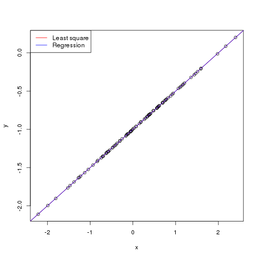 

*We reduced the noise by decreasing the variance of the normal distribution used to generate the error term $\varepsilon$. We may see that the coefficients are very close to the previous ones, but now, as the relationship is nearly linear, we have a much higher $R^2$ namely 1. Moreover, the two lines overlap each other as we have very little noise.*

(i) Repeat (a)-(f) after modifying the data generation process in such a way that there is more noise in the data. The initial model should remain the same. Describe your results.


```r
set.seed(1)
x <- rnorm(100)
eps <- rnorm(100, sd = 2.5)
y <- -1 + 0.5 * x + eps
plot(x, y)
fit12 <- lm(y ~ x)
summary(fit12)
```

```
## 
## Call:
## lm(formula = y ~ x)
## 
## Residuals:
##    Min     1Q Median     3Q    Max 
## -4.692 -1.534 -0.349  1.349  5.865 
## 
## Coefficients:
##             Estimate Std. Error t value Pr(>|t|)    
## (Intercept)   -1.094      0.242   -4.51  1.8e-05 ***
## x              0.497      0.269    1.85    0.068 .  
## ---
## Signif. codes:  0 '***' 0.001 '**' 0.01 '*' 0.05 '.' 0.1 ' ' 1
## 
## Residual standard error: 2.41 on 98 degrees of freedom
## Multiple R-squared:  0.0336,	Adjusted R-squared:  0.0238 
## F-statistic: 3.41 on 1 and 98 DF,  p-value: 0.0678
```

```r
abline(fit12, col = "red")
abline(-1, 0.5, col = "blue")
legend("topleft", c("Least square", "Regression"), col = c("red", "blue"), lty = c(1, 1))
```

 

*We increased the noise by increasing the variance of the normal distribution used to generate the error term $\varepsilon$. We may see that the coefficients are again very close to the previous ones, but now, as the relationship is not quite linear, we have a much lower $R^2$. Moreover, the two lines are wider apart but are still really close to each other as we have a fairly large data set.*

(j) What are the confidence intervals for $\beta_0$ and $\beta_1$ based on the original data set, the noisier data set, and the less noisy data set ? Comment on your results.


```r
confint(fit9)
```

```
##               2.5 %  97.5 %
## (Intercept) -1.0575 -0.9613
## x            0.4463  0.5532
```

```r
confint(fit11)
```

```
##               2.5 %  97.5 %
## (Intercept) -1.0006 -0.9996
## x            0.4995  0.5005
```

```r
confint(fit12)
```

```
##               2.5 %  97.5 %
## (Intercept) -1.5754 -0.6131
## x           -0.0371  1.0318
```

*As the noise increases, the confidence intervals widen. With less noise, there is more predactibility in the data set.*

**Q14.** This problem focuses on the collinearity problem.

(a) Perform the following commands in R.


```r
set.seed(1)
x1 <- runif(100)
x2 <- 0.5 * x1 + rnorm(100)/10
y <- 2 + 2 * x1 + 0.3 * x2 + rnorm(100)
```

The last line corresponds to creating a linear model in which "y" is a function of "x1" and "x2". Write out the form of the linear model. What are the regression coefficients ?

*The form of the linear model is
\[Y = 2 + 2X_1 +0.3X_2 + \varepsilon\]
with $\varepsilon$ a $N(0,1)$ random variable. The regression coefficients are respectively 2, 2 and 0.3.*

(b) What is the correlation between "x1" and "x2" ? Create a scatterplot displaying the relationship between the variables.


```r
cor(x1, x2)
```

```
## [1] 0.8351
```

```r
plot(x1, x2)
```

 

*The variables seem highly correlated.*

(c) Using this data, fit a least squares regression to predict "y" using "x1" and "x2". Describe the results obtained. What are $\hat{\beta}_0$, $\hat{\beta}_1$ and $\hat{\beta}_2$ ? How do these relate to the true $\beta_0$, $\beta_1$ and $\beta_2$ ? Can you reject the null hypothesis $H_0 : \beta_1 = 0$ ? How about the null hypothesis $H_0 : \beta_2 = 0$ ?


```r
fit13 <- lm(y ~ x1 + x2)
summary(fit13)
```

```
## 
## Call:
## lm(formula = y ~ x1 + x2)
## 
## Residuals:
##     Min      1Q  Median      3Q     Max 
## -2.8311 -0.7273 -0.0537  0.6338  2.3359 
## 
## Coefficients:
##             Estimate Std. Error t value Pr(>|t|)    
## (Intercept)    2.130      0.232    9.19  7.6e-15 ***
## x1             1.440      0.721    2.00    0.049 *  
## x2             1.010      1.134    0.89    0.375    
## ---
## Signif. codes:  0 '***' 0.001 '**' 0.01 '*' 0.05 '.' 0.1 ' ' 1
## 
## Residual standard error: 1.06 on 97 degrees of freedom
## Multiple R-squared:  0.209,	Adjusted R-squared:  0.193 
## F-statistic: 12.8 on 2 and 97 DF,  p-value: 1.16e-05
```

*The coefficients $\hat{\beta}_0$, $\hat{\beta}_1$ and $\hat{\beta}_2$ are respectively 2.1305, 1.4396 and 1.0097. Only $\hat{\beta}_0$ is close to $\beta_0$. As the p-value is less than 0.05 we may reject $H_0$ for $\beta_1$, however we may not reject $H_0$ for $\beta_2$ as the p-value is higher than 0.05.*

(d) Now fit a least squares regression to predict "y" using only "x1". Comment on your results. Can you reject the null hypothesis $H_0 : \beta_1 = 0$ ?


```r
fit14 <- lm(y ~ x1)
summary(fit14)
```

```
## 
## Call:
## lm(formula = y ~ x1)
## 
## Residuals:
##     Min      1Q  Median      3Q     Max 
## -2.8950 -0.6687 -0.0779  0.5922  2.4556 
## 
## Coefficients:
##             Estimate Std. Error t value Pr(>|t|)    
## (Intercept)    2.112      0.231    9.15  8.3e-15 ***
## x1             1.976      0.396    4.99  2.7e-06 ***
## ---
## Signif. codes:  0 '***' 0.001 '**' 0.01 '*' 0.05 '.' 0.1 ' ' 1
## 
## Residual standard error: 1.06 on 98 degrees of freedom
## Multiple R-squared:  0.202,	Adjusted R-squared:  0.194 
## F-statistic: 24.9 on 1 and 98 DF,  p-value: 2.66e-06
```

*The coefficient for "x1" in this last model is very different from the one with "x1" and "x2" as predictors. In this case "x1" is highly significant as its p-value is very low, so we may reject $H_0$.*

(e) Now fit a least squares regression to predict "y" using only "x2". Comment on your results. Can you reject the null hypothesis $H_0 : \beta_1 = 0$ ?


```r
fit15 <- lm(y ~ x2)
summary(fit15)
```

```
## 
## Call:
## lm(formula = y ~ x2)
## 
## Residuals:
##    Min     1Q Median     3Q    Max 
## -2.627 -0.752 -0.036  0.724  2.449 
## 
## Coefficients:
##             Estimate Std. Error t value Pr(>|t|)    
## (Intercept)    2.390      0.195   12.26  < 2e-16 ***
## x2             2.900      0.633    4.58  1.4e-05 ***
## ---
## Signif. codes:  0 '***' 0.001 '**' 0.01 '*' 0.05 '.' 0.1 ' ' 1
## 
## Residual standard error: 1.07 on 98 degrees of freedom
## Multiple R-squared:  0.176,	Adjusted R-squared:  0.168 
## F-statistic:   21 on 1 and 98 DF,  p-value: 1.37e-05
```

*The coefficient for "x2" in this last model is very different from the one with "x1" and "x2" as predictors. In this case "x2" is highly significant as its p-value is very low, so we may again reject $H_0$.*

(f) Do the results obtained in (c)-(e) contradict each other ? Explain your answer.

*No, the results do not contradict each other. As the predictors "x1" and "x2" are highly correlated we are in the presence of collinearity, in this case it can be difficult to determine how each predictor separately is associated with the response. Since collinearity reduces the accuracy of the estimates of the regression coefficients, it causes the standard error for $\hat{\beta}_1$ to grow (we have a standard error of 0.7212 and 1.1337 for "x1" and "x2" respectively in the model with two predictors and only of 0.3963 and 0.633 for "x1" and "x2" respectively in the models with only one predictor). Consequently, we may fail to reject $H_0$ in the presence of collinearity. The importance of the "x2" variable has been masked due to the presence of collinearity.*

(g) Now suppose we obtain one additional observation, which was unfortunately mismeasured.


```r
x1 <- c(x1, 0.1)
x2 <- c(x2, 0.8)
y <- c(y, 6)
```

Re-fit the linear models from (c) to (e) using this new data. What effect does this new observation have on each of the models ? In each model, is this observation an outlier ? A high-leverage point ? Explain your answers.


```r
fit16 <- lm(y ~ x1 + x2)
fit17 <- lm(y ~ x1)
fit18 <- lm(y ~ x2)
summary(fit16)
```

```
## 
## Call:
## lm(formula = y ~ x1 + x2)
## 
## Residuals:
##     Min      1Q  Median      3Q     Max 
## -2.7335 -0.6932 -0.0526  0.6638  2.3062 
## 
## Coefficients:
##             Estimate Std. Error t value Pr(>|t|)    
## (Intercept)    2.227      0.231    9.62  7.9e-16 ***
## x1             0.539      0.592    0.91   0.3646    
## x2             2.515      0.898    2.80   0.0061 ** 
## ---
## Signif. codes:  0 '***' 0.001 '**' 0.01 '*' 0.05 '.' 0.1 ' ' 1
## 
## Residual standard error: 1.07 on 98 degrees of freedom
## Multiple R-squared:  0.219,	Adjusted R-squared:  0.203 
## F-statistic: 13.7 on 2 and 98 DF,  p-value: 5.56e-06
```

```r
summary(fit17)
```

```
## 
## Call:
## lm(formula = y ~ x1)
## 
## Residuals:
##    Min     1Q Median     3Q    Max 
## -2.890 -0.656 -0.091  0.568  3.567 
## 
## Coefficients:
##             Estimate Std. Error t value Pr(>|t|)    
## (Intercept)    2.257      0.239    9.44  1.8e-15 ***
## x1             1.766      0.412    4.28  4.3e-05 ***
## ---
## Signif. codes:  0 '***' 0.001 '**' 0.01 '*' 0.05 '.' 0.1 ' ' 1
## 
## Residual standard error: 1.11 on 99 degrees of freedom
## Multiple R-squared:  0.156,	Adjusted R-squared:  0.148 
## F-statistic: 18.3 on 1 and 99 DF,  p-value: 4.29e-05
```

```r
summary(fit18)
```

```
## 
## Call:
## lm(formula = y ~ x2)
## 
## Residuals:
##    Min     1Q Median     3Q    Max 
## -2.647 -0.710 -0.069  0.727  2.381 
## 
## Coefficients:
##             Estimate Std. Error t value Pr(>|t|)    
## (Intercept)    2.345      0.191   12.26  < 2e-16 ***
## x2             3.119      0.604    5.16  1.3e-06 ***
## ---
## Signif. codes:  0 '***' 0.001 '**' 0.01 '*' 0.05 '.' 0.1 ' ' 1
## 
## Residual standard error: 1.07 on 99 degrees of freedom
## Multiple R-squared:  0.212,	Adjusted R-squared:  0.204 
## F-statistic: 26.7 on 1 and 99 DF,  p-value: 1.25e-06
```

```r
plot(fit16)
```

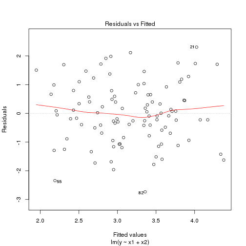  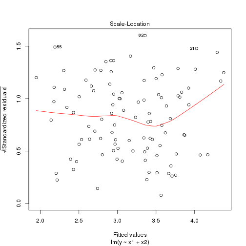 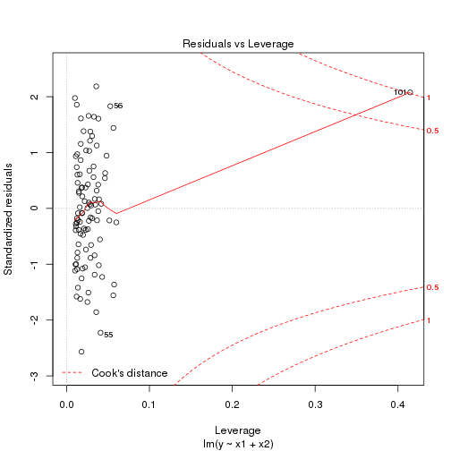 

```r
plot(fit17)
```

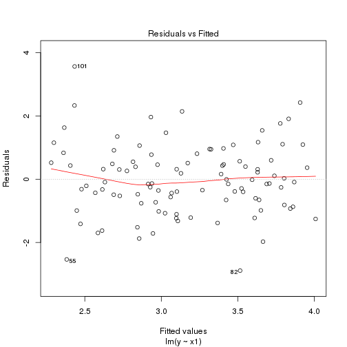 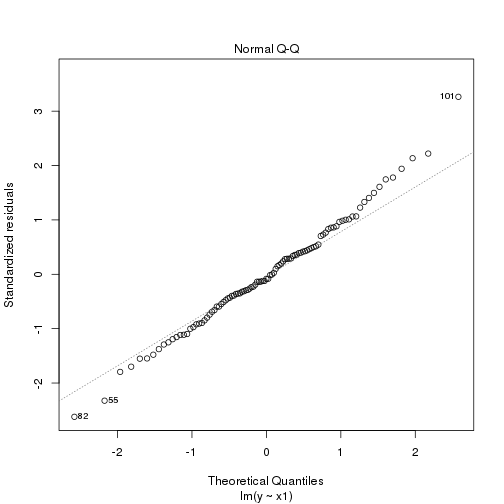 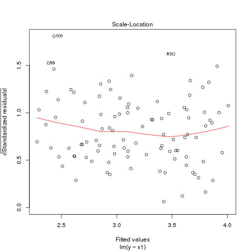 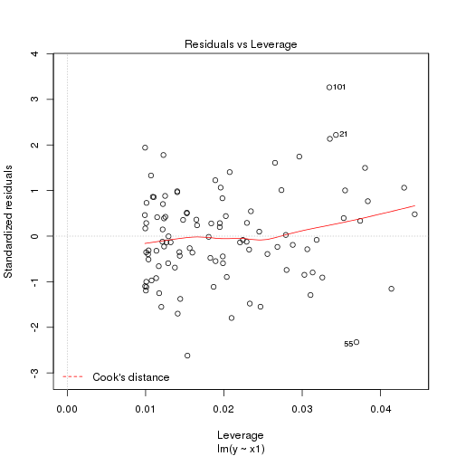 

```r
plot(fit18)
```

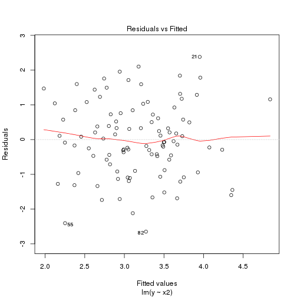  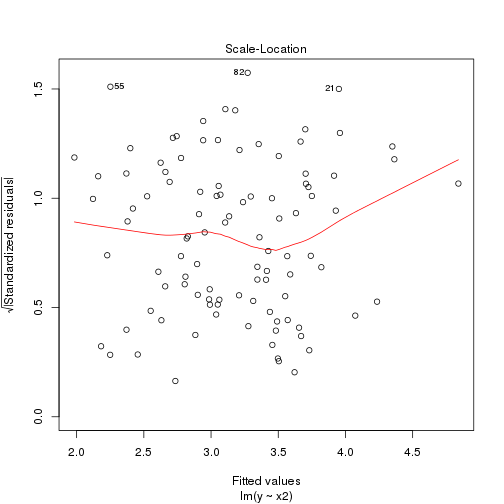 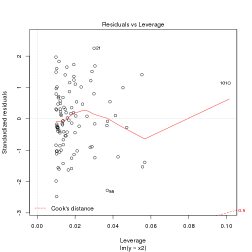 

*In the model with two predictors, the last point is a high-leverage point. In the model with "x1" as sole predictor, the last point is an outlier. In the model with "x2" as sole predictor, the last point is a high leverage point.*

**Q15.** This problem involves the "Boston" data set, which we saw in the lab for this chapter. We will now try to predict per capita crime rate using the other variables in this data set. In other words, per capita crime rate is the response, and the other variables are th predictors.

(a) For each predictor, fit a simple linear regression model to predict the response. Describe your results. In which of the models is there a statistically significant association between the predictor and the response ? Create some plots to back up your assertions.


```r
library(MASS)
```

```
## 
## Attaching package: 'MASS'
## 
## The following object is masked _by_ '.GlobalEnv':
## 
##     Boston
```

```r
attach(Boston)
```

```
## The following object is masked _by_ .GlobalEnv:
## 
##     chas
```

```r
fit.zn <- lm(crim ~ zn)
summary(fit.zn)
```

```
## 
## Call:
## lm(formula = crim ~ zn)
## 
## Residuals:
##    Min     1Q Median     3Q    Max 
##  -4.43  -4.22  -2.62   1.25  84.52 
## 
## Coefficients:
##             Estimate Std. Error t value Pr(>|t|)    
## (Intercept)   4.4537     0.4172   10.67  < 2e-16 ***
## zn           -0.0739     0.0161   -4.59  5.5e-06 ***
## ---
## Signif. codes:  0 '***' 0.001 '**' 0.01 '*' 0.05 '.' 0.1 ' ' 1
## 
## Residual standard error: 8.44 on 504 degrees of freedom
## Multiple R-squared:  0.0402,	Adjusted R-squared:  0.0383 
## F-statistic: 21.1 on 1 and 504 DF,  p-value: 5.51e-06
```

```r
fit.indus <- lm(crim ~ indus)
summary(fit.indus)
```

```
## 
## Call:
## lm(formula = crim ~ indus)
## 
## Residuals:
##    Min     1Q Median     3Q    Max 
## -11.97  -2.70  -0.74   0.71  81.81 
## 
## Coefficients:
##             Estimate Std. Error t value Pr(>|t|)    
## (Intercept)   -2.064      0.667   -3.09   0.0021 ** 
## indus          0.510      0.051    9.99   <2e-16 ***
## ---
## Signif. codes:  0 '***' 0.001 '**' 0.01 '*' 0.05 '.' 0.1 ' ' 1
## 
## Residual standard error: 7.87 on 504 degrees of freedom
## Multiple R-squared:  0.165,	Adjusted R-squared:  0.164 
## F-statistic: 99.8 on 1 and 504 DF,  p-value: <2e-16
```

```r
chas <- as.factor(chas)
fit.chas <- lm(crim ~ chas)
summary(fit.chas)
```

```
## 
## Call:
## lm(formula = crim ~ chas)
## 
## Residuals:
##    Min     1Q Median     3Q    Max 
##  -3.74  -3.66  -3.44   0.02  85.23 
## 
## Coefficients:
##             Estimate Std. Error t value Pr(>|t|)    
## (Intercept)    3.744      0.396    9.45   <2e-16 ***
## chas1         -1.893      1.506   -1.26     0.21    
## ---
## Signif. codes:  0 '***' 0.001 '**' 0.01 '*' 0.05 '.' 0.1 ' ' 1
## 
## Residual standard error: 8.6 on 504 degrees of freedom
## Multiple R-squared:  0.00312,	Adjusted R-squared:  0.00115 
## F-statistic: 1.58 on 1 and 504 DF,  p-value: 0.209
```

```r
fit.nox <- lm(crim ~ nox)
summary(fit.nox)
```

```
## 
## Call:
## lm(formula = crim ~ nox)
## 
## Residuals:
##    Min     1Q Median     3Q    Max 
## -12.37  -2.74  -0.97   0.56  81.73 
## 
## Coefficients:
##             Estimate Std. Error t value Pr(>|t|)    
## (Intercept)    -13.7        1.7   -8.07  5.1e-15 ***
## nox             31.2        3.0   10.42  < 2e-16 ***
## ---
## Signif. codes:  0 '***' 0.001 '**' 0.01 '*' 0.05 '.' 0.1 ' ' 1
## 
## Residual standard error: 7.81 on 504 degrees of freedom
## Multiple R-squared:  0.177,	Adjusted R-squared:  0.176 
## F-statistic:  109 on 1 and 504 DF,  p-value: <2e-16
```

```r
fit.rm <- lm(crim ~ rm)
summary(fit.rm)
```

```
## 
## Call:
## lm(formula = crim ~ rm)
## 
## Residuals:
##    Min     1Q Median     3Q    Max 
##  -6.60  -3.95  -2.65   0.99  87.20 
## 
## Coefficients:
##             Estimate Std. Error t value Pr(>|t|)    
## (Intercept)   20.482      3.364    6.09  2.3e-09 ***
## rm            -2.684      0.532   -5.04  6.3e-07 ***
## ---
## Signif. codes:  0 '***' 0.001 '**' 0.01 '*' 0.05 '.' 0.1 ' ' 1
## 
## Residual standard error: 8.4 on 504 degrees of freedom
## Multiple R-squared:  0.0481,	Adjusted R-squared:  0.0462 
## F-statistic: 25.5 on 1 and 504 DF,  p-value: 6.35e-07
```

```r
fit.age <- lm(crim ~ age)
summary(fit.age)
```

```
## 
## Call:
## lm(formula = crim ~ age)
## 
## Residuals:
##    Min     1Q Median     3Q    Max 
##  -6.79  -4.26  -1.23   1.53  82.85 
## 
## Coefficients:
##             Estimate Std. Error t value Pr(>|t|)    
## (Intercept)  -3.7779     0.9440   -4.00  7.2e-05 ***
## age           0.1078     0.0127    8.46  2.9e-16 ***
## ---
## Signif. codes:  0 '***' 0.001 '**' 0.01 '*' 0.05 '.' 0.1 ' ' 1
## 
## Residual standard error: 8.06 on 504 degrees of freedom
## Multiple R-squared:  0.124,	Adjusted R-squared:  0.123 
## F-statistic: 71.6 on 1 and 504 DF,  p-value: 2.85e-16
```

```r
fit.dis <- lm(crim ~ dis)
summary(fit.dis)
```

```
## 
## Call:
## lm(formula = crim ~ dis)
## 
## Residuals:
##    Min     1Q Median     3Q    Max 
##  -6.71  -4.13  -1.53   1.52  81.67 
## 
## Coefficients:
##             Estimate Std. Error t value Pr(>|t|)    
## (Intercept)    9.499      0.730   13.01   <2e-16 ***
## dis           -1.551      0.168   -9.21   <2e-16 ***
## ---
## Signif. codes:  0 '***' 0.001 '**' 0.01 '*' 0.05 '.' 0.1 ' ' 1
## 
## Residual standard error: 7.97 on 504 degrees of freedom
## Multiple R-squared:  0.144,	Adjusted R-squared:  0.142 
## F-statistic: 84.9 on 1 and 504 DF,  p-value: <2e-16
```

```r
fit.rad <- lm(crim ~ rad)
summary(fit.rad)
```

```
## 
## Call:
## lm(formula = crim ~ rad)
## 
## Residuals:
##    Min     1Q Median     3Q    Max 
## -10.16  -1.38  -0.14   0.66  76.43 
## 
## Coefficients:
##             Estimate Std. Error t value Pr(>|t|)    
## (Intercept)  -2.2872     0.4435   -5.16  3.6e-07 ***
## rad           0.6179     0.0343   18.00  < 2e-16 ***
## ---
## Signif. codes:  0 '***' 0.001 '**' 0.01 '*' 0.05 '.' 0.1 ' ' 1
## 
## Residual standard error: 6.72 on 504 degrees of freedom
## Multiple R-squared:  0.391,	Adjusted R-squared:  0.39 
## F-statistic:  324 on 1 and 504 DF,  p-value: <2e-16
```

```r
fit.tax <- lm(crim ~ tax)
summary(fit.tax)
```

```
## 
## Call:
## lm(formula = crim ~ tax)
## 
## Residuals:
##    Min     1Q Median     3Q    Max 
## -12.51  -2.74  -0.19   1.07  77.70 
## 
## Coefficients:
##             Estimate Std. Error t value Pr(>|t|)    
## (Intercept) -8.52837    0.81581   -10.4   <2e-16 ***
## tax          0.02974    0.00185    16.1   <2e-16 ***
## ---
## Signif. codes:  0 '***' 0.001 '**' 0.01 '*' 0.05 '.' 0.1 ' ' 1
## 
## Residual standard error: 7 on 504 degrees of freedom
## Multiple R-squared:  0.34,	Adjusted R-squared:  0.338 
## F-statistic:  259 on 1 and 504 DF,  p-value: <2e-16
```

```r
fit.ptratio <- lm(crim ~ ptratio)
summary(fit.ptratio)
```

```
## 
## Call:
## lm(formula = crim ~ ptratio)
## 
## Residuals:
##    Min     1Q Median     3Q    Max 
##  -7.65  -3.99  -1.91   1.82  83.35 
## 
## Coefficients:
##             Estimate Std. Error t value Pr(>|t|)    
## (Intercept)  -17.647      3.147   -5.61  3.4e-08 ***
## ptratio        1.152      0.169    6.80  2.9e-11 ***
## ---
## Signif. codes:  0 '***' 0.001 '**' 0.01 '*' 0.05 '.' 0.1 ' ' 1
## 
## Residual standard error: 8.24 on 504 degrees of freedom
## Multiple R-squared:  0.0841,	Adjusted R-squared:  0.0823 
## F-statistic: 46.3 on 1 and 504 DF,  p-value: 2.94e-11
```

```r
fit.black <- lm(crim ~ black)
summary(fit.black)
```

```
## 
## Call:
## lm(formula = crim ~ black)
## 
## Residuals:
##    Min     1Q Median     3Q    Max 
## -13.76  -2.30  -2.09  -1.30  86.82 
## 
## Coefficients:
##             Estimate Std. Error t value Pr(>|t|)    
## (Intercept) 16.55353    1.42590   11.61   <2e-16 ***
## black       -0.03628    0.00387   -9.37   <2e-16 ***
## ---
## Signif. codes:  0 '***' 0.001 '**' 0.01 '*' 0.05 '.' 0.1 ' ' 1
## 
## Residual standard error: 7.95 on 504 degrees of freedom
## Multiple R-squared:  0.148,	Adjusted R-squared:  0.147 
## F-statistic: 87.7 on 1 and 504 DF,  p-value: <2e-16
```

```r
fit.lstat <- lm(crim ~ lstat)
summary(fit.lstat)
```

```
## 
## Call:
## lm(formula = crim ~ lstat)
## 
## Residuals:
##    Min     1Q Median     3Q    Max 
## -13.93  -2.82  -0.66   1.08  82.86 
## 
## Coefficients:
##             Estimate Std. Error t value Pr(>|t|)    
## (Intercept)  -3.3305     0.6938    -4.8  2.1e-06 ***
## lstat         0.5488     0.0478    11.5  < 2e-16 ***
## ---
## Signif. codes:  0 '***' 0.001 '**' 0.01 '*' 0.05 '.' 0.1 ' ' 1
## 
## Residual standard error: 7.66 on 504 degrees of freedom
## Multiple R-squared:  0.208,	Adjusted R-squared:  0.206 
## F-statistic:  132 on 1 and 504 DF,  p-value: <2e-16
```

```r
fit.medv <- lm(crim ~ medv)
summary(fit.medv)
```

```
## 
## Call:
## lm(formula = crim ~ medv)
## 
## Residuals:
##    Min     1Q Median     3Q    Max 
##  -9.07  -4.02  -2.34   1.30  80.96 
## 
## Coefficients:
##             Estimate Std. Error t value Pr(>|t|)    
## (Intercept)  11.7965     0.9342   12.63   <2e-16 ***
## medv         -0.3632     0.0384   -9.46   <2e-16 ***
## ---
## Signif. codes:  0 '***' 0.001 '**' 0.01 '*' 0.05 '.' 0.1 ' ' 1
## 
## Residual standard error: 7.93 on 504 degrees of freedom
## Multiple R-squared:  0.151,	Adjusted R-squared:  0.149 
## F-statistic: 89.5 on 1 and 504 DF,  p-value: <2e-16
```

*To find which predictors are significant, we have to test $H_0 : \beta_1 = 0$. All predictors have a p-value less than 0.05 except "chas", so we may conclude that there is a statistically significant association between each predictor and the response except for the "chas" predictor.*

(b) Fit a multiple regression model to predict the response using all of the predictors. Describe your results. For which predictors can we reject the null hypothesis $H_0 : \beta_j = 0$ ?


```r
fit.all <- lm(crim ~ ., data = Boston)
summary(fit.all)
```

```
## 
## Call:
## lm(formula = crim ~ ., data = Boston)
## 
## Residuals:
##    Min     1Q Median     3Q    Max 
##  -9.92  -2.12  -0.35   1.02  75.05 
## 
## Coefficients:
##              Estimate Std. Error t value Pr(>|t|)    
## (Intercept)  17.03323    7.23490    2.35   0.0189 *  
## zn            0.04486    0.01873    2.39   0.0170 *  
## indus        -0.06385    0.08341   -0.77   0.4443    
## chas1        -0.74913    1.18015   -0.63   0.5259    
## nox         -10.31353    5.27554   -1.95   0.0512 .  
## rm            0.43013    0.61283    0.70   0.4831    
## age           0.00145    0.01793    0.08   0.9355    
## dis          -0.98718    0.28182   -3.50   0.0005 ***
## rad           0.58821    0.08805    6.68  6.5e-11 ***
## tax          -0.00378    0.00516   -0.73   0.4638    
## ptratio      -0.27108    0.18645   -1.45   0.1466    
## black        -0.00754    0.00367   -2.05   0.0407 *  
## lstat         0.12621    0.07572    1.67   0.0962 .  
## medv         -0.19889    0.06052   -3.29   0.0011 ** 
## ---
## Signif. codes:  0 '***' 0.001 '**' 0.01 '*' 0.05 '.' 0.1 ' ' 1
## 
## Residual standard error: 6.44 on 492 degrees of freedom
## Multiple R-squared:  0.454,	Adjusted R-squared:  0.44 
## F-statistic: 31.5 on 13 and 492 DF,  p-value: <2e-16
```

*We may reject the null hypothesis for "zn", "dis", "rad", "black" and "medv".*

(c) How do your results from (a) compare to your results from (b) ? Create a plot displaying the univariate regression coefficients from (a) on the x-axis, and the multiple regression coefficients from (b) on the y-axis. That is, each predictor is displayed as a single point on the plot. Its coefficient in a simple linear regression model is shown on the x-axis, and its coefficient estimate in the multiple linear regression model is shown on the y-axis.


```r
simple.reg <- vector("numeric",0)
simple.reg <- c(simple.reg, fit.zn$coefficient[2])
simple.reg <- c(simple.reg, fit.indus$coefficient[2])
simple.reg <- c(simple.reg, fit.chas$coefficient[2])
simple.reg <- c(simple.reg, fit.nox$coefficient[2])
simple.reg <- c(simple.reg, fit.rm$coefficient[2])
simple.reg <- c(simple.reg, fit.age$coefficient[2])
simple.reg <- c(simple.reg, fit.dis$coefficient[2])
simple.reg <- c(simple.reg, fit.rad$coefficient[2])
simple.reg <- c(simple.reg, fit.tax$coefficient[2])
simple.reg <- c(simple.reg, fit.ptratio$coefficient[2])
simple.reg <- c(simple.reg, fit.black$coefficient[2])
simple.reg <- c(simple.reg, fit.lstat$coefficient[2])
simple.reg <- c(simple.reg, fit.medv$coefficient[2])
mult.reg <- vector("numeric", 0)
mult.reg <- c(mult.reg, fit.all$coefficients)
mult.reg <- mult.reg[-1]
plot(simple.reg, mult.reg, col = "red")
```

 

*There is a difference between the simple and multiple regression coefficients. This difference is due to the fact that in the simple regression case, the slope term represents the average effect of an increase in the predictor, ignoring other predictors. In contrast, in the multiple regression case, the slope term represents the average effect of an increase in the predictor, while holding other predictors fixed. It does make sense for the multiple regression to suggest no relationship between the response and some of the predictors while the simple linear regression implies the opposite because the correlation between the predictors show some strong relationships between some of the predictors.*


```r
cor(Boston[-c(1, 4)])
```

```
##              zn   indus     nox      rm     age     dis     rad     tax
## zn       1.0000 -0.5338 -0.5166  0.3120 -0.5695  0.6644 -0.3119 -0.3146
## indus   -0.5338  1.0000  0.7637 -0.3917  0.6448 -0.7080  0.5951  0.7208
## nox     -0.5166  0.7637  1.0000 -0.3022  0.7315 -0.7692  0.6114  0.6680
## rm       0.3120 -0.3917 -0.3022  1.0000 -0.2403  0.2052 -0.2098 -0.2920
## age     -0.5695  0.6448  0.7315 -0.2403  1.0000 -0.7479  0.4560  0.5065
## dis      0.6644 -0.7080 -0.7692  0.2052 -0.7479  1.0000 -0.4946 -0.5344
## rad     -0.3119  0.5951  0.6114 -0.2098  0.4560 -0.4946  1.0000  0.9102
## tax     -0.3146  0.7208  0.6680 -0.2920  0.5065 -0.5344  0.9102  1.0000
## ptratio -0.3917  0.3832  0.1889 -0.3555  0.2615 -0.2325  0.4647  0.4609
## black    0.1755 -0.3570 -0.3801  0.1281 -0.2735  0.2915 -0.4444 -0.4418
## lstat   -0.4130  0.6038  0.5909 -0.6138  0.6023 -0.4970  0.4887  0.5440
## medv     0.3604 -0.4837 -0.4273  0.6954 -0.3770  0.2499 -0.3816 -0.4685
##         ptratio   black   lstat    medv
## zn      -0.3917  0.1755 -0.4130  0.3604
## indus    0.3832 -0.3570  0.6038 -0.4837
## nox      0.1889 -0.3801  0.5909 -0.4273
## rm      -0.3555  0.1281 -0.6138  0.6954
## age      0.2615 -0.2735  0.6023 -0.3770
## dis     -0.2325  0.2915 -0.4970  0.2499
## rad      0.4647 -0.4444  0.4887 -0.3816
## tax      0.4609 -0.4418  0.5440 -0.4685
## ptratio  1.0000 -0.1774  0.3740 -0.5078
## black   -0.1774  1.0000 -0.3661  0.3335
## lstat    0.3740 -0.3661  1.0000 -0.7377
## medv    -0.5078  0.3335 -0.7377  1.0000
```

*So for example, when "age" is high there is a tendency in "dis" to be low, hence in simple linear regression which only examines "crim" versus "age", we observe that higher values of "age" are associated with higher values of "crim", even though "age" does not actually affect "crim". So "age" is a surrogate for "dis"; "age" gets credit for the effect of "dis" on "crim".*

(d) Is there evidence of non-linear association between any of the predictors and the response ? To answer this question, for each predictor $X$, fit a model of the form
\[Y = \beta_0 + \beta_1 X + \beta_2 X^2 + \beta_3 X^3 + \varepsilon.\]


```r
fit.zn2 <- lm(crim ~ poly(zn, 3))
summary(fit.zn2)
```

```
## 
## Call:
## lm(formula = crim ~ poly(zn, 3))
## 
## Residuals:
##    Min     1Q Median     3Q    Max 
##  -4.82  -4.61  -1.29   0.47  84.13 
## 
## Coefficients:
##              Estimate Std. Error t value Pr(>|t|)    
## (Intercept)     3.614      0.372    9.71  < 2e-16 ***
## poly(zn, 3)1  -38.750      8.372   -4.63  4.7e-06 ***
## poly(zn, 3)2   23.940      8.372    2.86   0.0044 ** 
## poly(zn, 3)3  -10.072      8.372   -1.20   0.2295    
## ---
## Signif. codes:  0 '***' 0.001 '**' 0.01 '*' 0.05 '.' 0.1 ' ' 1
## 
## Residual standard error: 8.37 on 502 degrees of freedom
## Multiple R-squared:  0.0582,	Adjusted R-squared:  0.0526 
## F-statistic: 10.3 on 3 and 502 DF,  p-value: 1.28e-06
```

```r
fit.indus2 <- lm(crim ~ poly(indus, 3))
summary(fit.indus2)
```

```
## 
## Call:
## lm(formula = crim ~ poly(indus, 3))
## 
## Residuals:
##    Min     1Q Median     3Q    Max 
##  -8.28  -2.51   0.05   0.76  79.71 
## 
## Coefficients:
##                 Estimate Std. Error t value Pr(>|t|)    
## (Intercept)         3.61       0.33   10.95  < 2e-16 ***
## poly(indus, 3)1    78.59       7.42   10.59  < 2e-16 ***
## poly(indus, 3)2   -24.39       7.42   -3.29   0.0011 ** 
## poly(indus, 3)3   -54.13       7.42   -7.29  1.2e-12 ***
## ---
## Signif. codes:  0 '***' 0.001 '**' 0.01 '*' 0.05 '.' 0.1 ' ' 1
## 
## Residual standard error: 7.42 on 502 degrees of freedom
## Multiple R-squared:  0.26,	Adjusted R-squared:  0.255 
## F-statistic: 58.7 on 3 and 502 DF,  p-value: <2e-16
```

```r
fit.nox2 <- lm(crim ~ poly(nox, 3))
summary(fit.nox2)
```

```
## 
## Call:
## lm(formula = crim ~ poly(nox, 3))
## 
## Residuals:
##    Min     1Q Median     3Q    Max 
##  -9.11  -2.07  -0.25   0.74  78.30 
## 
## Coefficients:
##               Estimate Std. Error t value Pr(>|t|)    
## (Intercept)      3.614      0.322   11.24  < 2e-16 ***
## poly(nox, 3)1   81.372      7.234   11.25  < 2e-16 ***
## poly(nox, 3)2  -28.829      7.234   -3.99  7.7e-05 ***
## poly(nox, 3)3  -60.362      7.234   -8.34  7.0e-16 ***
## ---
## Signif. codes:  0 '***' 0.001 '**' 0.01 '*' 0.05 '.' 0.1 ' ' 1
## 
## Residual standard error: 7.23 on 502 degrees of freedom
## Multiple R-squared:  0.297,	Adjusted R-squared:  0.293 
## F-statistic: 70.7 on 3 and 502 DF,  p-value: <2e-16
```

```r
fit.rm2 <- lm(crim ~ poly(rm, 3))
summary(fit.rm2)
```

```
## 
## Call:
## lm(formula = crim ~ poly(rm, 3))
## 
## Residuals:
##    Min     1Q Median     3Q    Max 
## -18.49  -3.47  -2.22  -0.01  87.22 
## 
## Coefficients:
##              Estimate Std. Error t value Pr(>|t|)    
## (Intercept)      3.61       0.37    9.76  < 2e-16 ***
## poly(rm, 3)1   -42.38       8.33   -5.09  5.1e-07 ***
## poly(rm, 3)2    26.58       8.33    3.19   0.0015 ** 
## poly(rm, 3)3    -5.51       8.33   -0.66   0.5086    
## ---
## Signif. codes:  0 '***' 0.001 '**' 0.01 '*' 0.05 '.' 0.1 ' ' 1
## 
## Residual standard error: 8.33 on 502 degrees of freedom
## Multiple R-squared:  0.0678,	Adjusted R-squared:  0.0622 
## F-statistic: 12.2 on 3 and 502 DF,  p-value: 1.07e-07
```

```r
fit.age2 <- lm(crim ~ poly(age, 3))
summary(fit.age2)
```

```
## 
## Call:
## lm(formula = crim ~ poly(age, 3))
## 
## Residuals:
##    Min     1Q Median     3Q    Max 
##  -9.76  -2.67  -0.52   0.02  82.84 
## 
## Coefficients:
##               Estimate Std. Error t value Pr(>|t|)    
## (Intercept)      3.614      0.349   10.37  < 2e-16 ***
## poly(age, 3)1   68.182      7.840    8.70  < 2e-16 ***
## poly(age, 3)2   37.484      7.840    4.78  2.3e-06 ***
## poly(age, 3)3   21.353      7.840    2.72   0.0067 ** 
## ---
## Signif. codes:  0 '***' 0.001 '**' 0.01 '*' 0.05 '.' 0.1 ' ' 1
## 
## Residual standard error: 7.84 on 502 degrees of freedom
## Multiple R-squared:  0.174,	Adjusted R-squared:  0.169 
## F-statistic: 35.3 on 3 and 502 DF,  p-value: <2e-16
```

```r
fit.dis2 <- lm(crim ~ poly(dis, 3))
summary(fit.dis2)
```

```
## 
## Call:
## lm(formula = crim ~ poly(dis, 3))
## 
## Residuals:
##    Min     1Q Median     3Q    Max 
## -10.76  -2.59   0.03   1.27  76.38 
## 
## Coefficients:
##               Estimate Std. Error t value Pr(>|t|)    
## (Intercept)      3.614      0.326   11.09  < 2e-16 ***
## poly(dis, 3)1  -73.389      7.331  -10.01  < 2e-16 ***
## poly(dis, 3)2   56.373      7.331    7.69  7.9e-14 ***
## poly(dis, 3)3  -42.622      7.331   -5.81  1.1e-08 ***
## ---
## Signif. codes:  0 '***' 0.001 '**' 0.01 '*' 0.05 '.' 0.1 ' ' 1
## 
## Residual standard error: 7.33 on 502 degrees of freedom
## Multiple R-squared:  0.278,	Adjusted R-squared:  0.274 
## F-statistic: 64.4 on 3 and 502 DF,  p-value: <2e-16
```

```r
fit.rad2 <- lm(crim ~ poly(rad, 3))
summary(fit.rad2)
```

```
## 
## Call:
## lm(formula = crim ~ poly(rad, 3))
## 
## Residuals:
##    Min     1Q Median     3Q    Max 
## -10.38  -0.41  -0.27   0.18  76.22 
## 
## Coefficients:
##               Estimate Std. Error t value Pr(>|t|)    
## (Intercept)      3.614      0.297   12.16   <2e-16 ***
## poly(rad, 3)1  120.907      6.682   18.09   <2e-16 ***
## poly(rad, 3)2   17.492      6.682    2.62   0.0091 ** 
## poly(rad, 3)3    4.698      6.682    0.70   0.4823    
## ---
## Signif. codes:  0 '***' 0.001 '**' 0.01 '*' 0.05 '.' 0.1 ' ' 1
## 
## Residual standard error: 6.68 on 502 degrees of freedom
## Multiple R-squared:   0.4,	Adjusted R-squared:  0.396 
## F-statistic:  112 on 3 and 502 DF,  p-value: <2e-16
```

```r
fit.tax2 <- lm(crim ~ poly(tax, 3))
summary(fit.tax2)
```

```
## 
## Call:
## lm(formula = crim ~ poly(tax, 3))
## 
## Residuals:
##    Min     1Q Median     3Q    Max 
## -13.27  -1.39   0.05   0.54  76.95 
## 
## Coefficients:
##               Estimate Std. Error t value Pr(>|t|)    
## (Intercept)      3.614      0.305   11.86  < 2e-16 ***
## poly(tax, 3)1  112.646      6.854   16.44  < 2e-16 ***
## poly(tax, 3)2   32.087      6.854    4.68  3.7e-06 ***
## poly(tax, 3)3   -7.997      6.854   -1.17     0.24    
## ---
## Signif. codes:  0 '***' 0.001 '**' 0.01 '*' 0.05 '.' 0.1 ' ' 1
## 
## Residual standard error: 6.85 on 502 degrees of freedom
## Multiple R-squared:  0.369,	Adjusted R-squared:  0.365 
## F-statistic: 97.8 on 3 and 502 DF,  p-value: <2e-16
```

```r
fit.ptratio2 <- lm(crim ~ poly(ptratio, 3))
summary(fit.ptratio2)
```

```
## 
## Call:
## lm(formula = crim ~ poly(ptratio, 3))
## 
## Residuals:
##    Min     1Q Median     3Q    Max 
##  -6.83  -4.15  -1.65   1.41  82.70 
## 
## Coefficients:
##                   Estimate Std. Error t value Pr(>|t|)    
## (Intercept)          3.614      0.361   10.01  < 2e-16 ***
## poly(ptratio, 3)1   56.045      8.122    6.90  1.6e-11 ***
## poly(ptratio, 3)2   24.775      8.122    3.05   0.0024 ** 
## poly(ptratio, 3)3  -22.280      8.122   -2.74   0.0063 ** 
## ---
## Signif. codes:  0 '***' 0.001 '**' 0.01 '*' 0.05 '.' 0.1 ' ' 1
## 
## Residual standard error: 8.12 on 502 degrees of freedom
## Multiple R-squared:  0.114,	Adjusted R-squared:  0.108 
## F-statistic: 21.5 on 3 and 502 DF,  p-value: 4.17e-13
```

```r
fit.black2 <- lm(crim ~ poly(black, 3))
summary(fit.black2)
```

```
## 
## Call:
## lm(formula = crim ~ poly(black, 3))
## 
## Residuals:
##    Min     1Q Median     3Q    Max 
## -13.10  -2.34  -2.13  -1.44  86.79 
## 
## Coefficients:
##                 Estimate Std. Error t value Pr(>|t|)    
## (Intercept)        3.614      0.354   10.22   <2e-16 ***
## poly(black, 3)1  -74.431      7.955   -9.36   <2e-16 ***
## poly(black, 3)2    5.926      7.955    0.75     0.46    
## poly(black, 3)3   -4.835      7.955   -0.61     0.54    
## ---
## Signif. codes:  0 '***' 0.001 '**' 0.01 '*' 0.05 '.' 0.1 ' ' 1
## 
## Residual standard error: 7.95 on 502 degrees of freedom
## Multiple R-squared:  0.15,	Adjusted R-squared:  0.145 
## F-statistic: 29.5 on 3 and 502 DF,  p-value: <2e-16
```

```r
fit.lstat2 <- lm(crim ~ poly(lstat, 3))
summary(fit.lstat2)
```

```
## 
## Call:
## lm(formula = crim ~ poly(lstat, 3))
## 
## Residuals:
##    Min     1Q Median     3Q    Max 
## -15.23  -2.15  -0.49   0.07  83.35 
## 
## Coefficients:
##                 Estimate Std. Error t value Pr(>|t|)    
## (Intercept)        3.614      0.339   10.65   <2e-16 ***
## poly(lstat, 3)1   88.070      7.629   11.54   <2e-16 ***
## poly(lstat, 3)2   15.888      7.629    2.08    0.038 *  
## poly(lstat, 3)3  -11.574      7.629   -1.52    0.130    
## ---
## Signif. codes:  0 '***' 0.001 '**' 0.01 '*' 0.05 '.' 0.1 ' ' 1
## 
## Residual standard error: 7.63 on 502 degrees of freedom
## Multiple R-squared:  0.218,	Adjusted R-squared:  0.213 
## F-statistic: 46.6 on 3 and 502 DF,  p-value: <2e-16
```

```r
fit.medv2 <- lm(crim ~ poly(medv, 3))
summary(fit.medv2)
```

```
## 
## Call:
## lm(formula = crim ~ poly(medv, 3))
## 
## Residuals:
##    Min     1Q Median     3Q    Max 
## -24.43  -1.98  -0.44   0.44  73.65 
## 
## Coefficients:
##                Estimate Std. Error t value Pr(>|t|)    
## (Intercept)       3.614      0.292   12.37   <2e-16 ***
## poly(medv, 3)1  -75.058      6.569  -11.43   <2e-16 ***
## poly(medv, 3)2   88.086      6.569   13.41   <2e-16 ***
## poly(medv, 3)3  -48.033      6.569   -7.31    1e-12 ***
## ---
## Signif. codes:  0 '***' 0.001 '**' 0.01 '*' 0.05 '.' 0.1 ' ' 1
## 
## Residual standard error: 6.57 on 502 degrees of freedom
## Multiple R-squared:  0.42,	Adjusted R-squared:  0.417 
## F-statistic:  121 on 3 and 502 DF,  p-value: <2e-16
```

*For "zn", "rm", "rad", "tax" and "lstat" as predictor, the p-values suggest that the cubic coefficient is not statistically significant; for "indus", "nox", "age", "dis", "ptratio" and "medv" as predictor, the p-values suggest the adequacy of the cubic fit; for "black" as predictor, the p-values suggest that the quandratic and cubic coefficients are not statistically significant, so in this latter case no non-linear effect is visible.*
