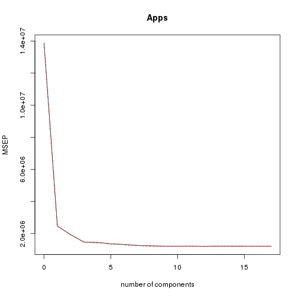

Solutions of the exercises from Chapter 4
============================================

## Conceptual

**Q1.** Using a little bit of algebra, prove that (4.2) is equivalent to (4.3). In other words, the logistic function representation and logit representation for the logistic regression model are equivalent.

*We have
\[p(X) = \frac{e^{\beta_0 + \beta_1 X}}{1 + e^{\beta_0 + \beta_1 X}} \Leftrightarrow e^{\beta_0 + \beta_1 X}(1 - p(X)) = p(X),\]
which is equivalent to
\[\frac{p(X)}{1 - p(X)} = e^{\beta_0 + \beta_1 X}.\]*

**Q2.** It was stated in the text that classifying an observation to the class for which (4.12) is largest is equivalent to classifying an observation to the class for which (4.13) is largest. Prove that this is the case. In other words, under the assumption that the observations in the kth class are drawn from a N(μk, σ2) distribution, the Bayes’ classifier assigns an observation to the class for which the discriminant function is maximized.

*To use the Bayes classifier, we have to find the class ($k$) for which
\[p_k(x) = \frac{\pi_k(1/\sqrt{2\pi}\sigma)e^{-(1/2\sigma^2)(x - \mu_k)^2}}{\sum_{l = 1}^K\pi_l(1/\sqrt{2\pi}\sigma)e^{-(1/2\sigma^2)(x - \mu_l)^2}} = \frac{\pi_ke^{-(1/2\sigma^2)(x - \mu_k)^2}}{\sum_{l = 1}^K\pi_le^{-(1/2\sigma^2)(x - \mu_l)^2}}\]
is largest. As the log function is monotonally increasing, it is equivalent to finding $k$ for which
\[\log p_k(x) = \log \pi_k -(1/2\sigma^2)(x - \mu_k)^2 - \log \sum_{l = 1}^K\pi_le^{-(1/2\sigma^2)(x - \mu_l)^2}\]
is largest. As the last term is independant of $k$, we may restrict ourselves in finding $k$ for which
\[\log \pi_k -(1/2\sigma^2)(x - \mu_k)^2 = \log\pi_k - \frac{1}{2\sigma^2}x^2 + \frac{\mu_k}{\sigma^2}x - \frac{\mu_k^2}{2\sigma^2}\]
is largest. The term in $x^2$ is independant of $k$, so it remains to find $k$ for which
\[\delta_k(x) = \frac{\mu_k}{\sigma^2}x - \frac{\mu_k^2}{2\sigma^2} + \log\pi_k\]
is largest.*

**Q3.** This problem relates to the QDA model, in which the observations within each class are drawn from a normal distribution with a classspecific mean vector and a class specific covariance matrix. We consider the simple case where $p = 1$; i.e. there is only one feature. Suppose that we have $K$ classes, and that if an observation belongs to the kth class then $X$ comes from a one-dimensional normal distribution, $X \sim N(\mu_k, \sigma_k)$. Recall that the density function for the one-dimensional normal distribution is given in (4.11). Prove that in this case, the Bayes’ classifier is not linear. Argue that it is in fact quadratic.

*If we proceed exactly as in the previous answer, we may see that finding $k$ for which $p_k(x)$ is largest is equivalent to finding $k$ for which
\[\log \pi_k -(1/2\sigma_k^2)(x - \mu_k)^2 = - \frac{1}{2\sigma_k^2}x^2 + \frac{\mu_k}{\sigma_k^2}x - \frac{\mu_k^2}{2\sigma_k^2} - \log\sigma_k + \log\pi_k\]
is largest. This last expression is obviously not linear in $x$.*

**Q4.** When the number of features p is large, there tends to be a deterioration in the performance of KNN and other local approaches that perform prediction using only observations that are near the test observation for which a prediction must be made. This phenomenon is known as the curse of dimensionality, and it ties into the fact that non-parametric approaches often perform poorly when p is large. We will now investigate this curse.

(a) Suppose that we have a set of observations, each with measurements on $p = 1$ feature, $X$. We assume that $X$ is uniformly (evenly) distributed on $[0,1]$. Associated with each observation is a response value. Suppose that we wish to predict a test observation’s response using only observations that are within 10% of the range of $X$ closest to that test observation. For instance, in order to predict the response for a test observation with $X = 0.6$, we will use observations in the range $[0.55,0.65]$. On average, what fraction of the available observations will we use to make the prediction ?

*It is clear that if $x\in[0.05,0.95]$ then the observations we will use are in the interval $[x - 0.05, x + 0.05]$ and consequently represents a length of $0.1$ which represents a fraction of $10\%$. If $x < 0.05$, then we will use observations in the interval $[0,x + 0.05]$ which represents a fraction of $(100x + 5)\%$; by a similar argument we conclude that if $x > 0.95$, then the fraction of observations we will use is $(105 - 100x)\%$. To compute the average fraction we will use to make the prediction we have to evaluate the following expression
\[\int_{0.05}^{0.95}10 dx + \int_0^{0.05}(100x + 5)dx + \int_{0.95}^1(105 - 100x)dx = 9 + 0.375 + 0.375 = 9.75.\]
So we may conclude that, on average, the fraction of available observations we will use to make the prediction is $9.75\%$.*

(b) Now suppose that we have a set of observations, each with measurements on $p = 2$ features, $X_1$ and $X_2$. We assume that $(X_1, X_2)$ are uniformly distributed on $[0,1]\times[0,1]$. We wish to predict a test observation’s response using only observations that are within 10% of the range of $X_1$ and within 10% of the range of $X_2$ closest to that test observation. For instance, in order to predict the response for a test observation with $X_1 = 0.6$ and $X_2 = 0.35$, we will use observations in the range $[0.55,0.65]$ for $X_1$ and in the range $[0.3,0.4]$ for $X_2$. On average, what fraction of the available observations will we use to make the prediction ?

*If we assume $X_1$ and $X_2$ to be independant, the fraction of available observations we will use to make the prediction is $9.75\%\times 9.75\% = 0.950625\%$.*

(c) Now suppose that we have a set of observations on $p = 100$ features. Again the observations are uniformly distributed on each feature, and again each feature ranges in value from 0 to 1. We wish to predict a test observation’s response using observations within the 10% of each feature’s range that is closest to that test observation. What fraction of the available observations will we use to make the prediction ?

*With the same argument than (a) and (b), we may conclude that the fraction of available observations we will use to make the prediction is $9.75\%^{100}\simeq 0\%$.*

(d) Using your answers to parts (a)-(c), argue that a drawback of KNN when $p$ is large is that there are very few training observations “near” any given test observation.

*As we saw in (a)-(c), the fraction of available observations we will use to make the prediction is $(9.75\%)^p$ with $p$ the number of features. So when $p\rightarrow\infty$, we have
\[\lim_{p\rightarrow\infty}(9.75\%)^p = 0.\]*

(e) Now suppose that we wish to make a prediction for a test observation by creating a p-dimensional hypercube centered around the test observation that contains, on average, 10% of the training observations. For $p = 1, 2, 100$, what is the length of each side of the hypercube ? Comment on your answer. Note: A hypercube is a generalization of a cube to an arbitrary number of dimensions. When $p = 1$, a hypercube is simply a line segment, when $p = 2$ it is a square, and when $p = 100$ it is a 100-dimensional cube.

**Q5.** We now examine the differences between LDA and QDA.

(a) If the Bayes decision boundary is linear, do we expect LDA or QDA to perform better on the training set ? On the test set ?

*If the Bayes decision boundary is linear, we expect QDA to perform better on the training set because its higher flexiblity may yield a closer fit. On the test set, we expect LDA to perform better than QDA, because QDA could overfit the linearity on the Bayes decision boundary.*

(b) If the Bayes decision boundary is non-linear, do we expect LDA or QDA to perform better on the training set? On the test set ?

*If the Bayes decision bounary is non-linear, we expect QDA to perform better both on the training and test sets.*

(c) In general, as the sample size $n$ increases, do we expect the test prediction accuracy of QDA relative to LDA to improve, decline, or be unchanged? Why ?

*Roughly speaking, QDA (which is more flexible than LDA and so has higher variance) is recommended if the training set is very large, so that the variance of the classifier is not a major concern.*

(d) True or False: Even if the Bayes decision boundary for a given problem is linear, we will probably achieve a superior test error rate using QDA rather than LDA because QDA is flexible enough to model a linear decision boundary. Justify your answer.

*False. With fewer sample points, the variance from using a more flexible method such as QDA, may lead to overfit, which in turns may lead to an inferior test error rate.*

**Q6.** Suppose we collect data for a group of students in a statistics class with variables $X_1 =$ hours studied, $X_2 =$ undergrad GPA, and $Y =$ receive an A. We fit a logistic regression and produce estimated coefficients, $\hat{\beta}_0 = −6$, $\hat{\beta}_1 = 0.05$, $\hat{\beta}_2 = 1$.

(a) Estimate the probability that a student who studies for 40 hours and has an undergrad GPA of 3.5 gets an A in the class.

*It suffices to plug in the beta values in the equation for predicted probability,
\[\hat{p}(X) = \frac{e^{-6 + 0.05X_1 + X_2}}{(1 + e^{-6 + 0.05X_1 + X_2})} = 0.3775.\]*

(b) How many hours would the student in part (a) need to study to have a 50% chance of getting an A in the class ?

*The equation for predicted probability tells us that
\[\frac{e^{-6 + 0.05X_1 + 3.5}}{(1 + e^{-6 + 0.05X_1 + 3.5})} = 0.5,\]
which is equivalent to
\[e^{-6 + 0.05X_1 + 3.5} = 1.\]
By taking the logarithm of both sides, we get
\[X_1 = \frac{2.5}{0.05} = 50.\]*

**Q7.** Suppose that we wish to predict whether a given stock will issue a dividend this year (“Yes” or “No”) based on $X$, last year’s percent profit. We examine a large number of companies and discover that the mean value of $X$ for companies that issued a dividend was $\overline{X} = 10$, while the mean for those that didn’t was $\overline{X} = 0$. In addition, the variance of $X$ for these two sets of companies was $\hat{\sigma}^2 = 36$. Finally, 80% of companies issued dividends. Assuming that $X$ follows a normal distribution, predict the probability that a company will issue a dividend this year given that its percentage return was $X = 4$ last year.

*It suffices to plug in the parameters and $X$ values in the equation for $p_k(x)$. We get
\[p_1(x) = \frac{0.8 e^{-(1/72)(x - 10)^2}}{0.8 e^{-(1/72)(x - 10)^2} + 0.2 e^{-(1/72)(x - 0)^2}} = 0.752;\]
so the probability that a company will issue a dividend this year given that its percentage return was $X = 4$ last year is $0.752$.*

**Q8.** Suppose that we take a data set, divide it into equally-sized training and test sets, and then try out two different classification procedures. First we use logistic regression and get an error rate of 20% on the training data and 30% on the test data. Next we use 1-nearest neighbors (i.e. $K = 1$) and get an average error rate (averaged over both test and training data sets) of 18%. Based on these results, which method should we prefer to use for classification of new observations ? Why ?

*In the case of KNN with $K = 1$, we have a training error rate of $0\%$ because in this case, we have
\[P(Y = j | X = x_i) = I(y_i = j)\]
which is equal to $1$ if $y_i = j$ and $0$ if not. We do not make any error on the training data within this setting, that explains the $0\%$ training error rate. However, we have an average error rate of $18\%$ wich implies a test error rate of $36\%$ for KNN which is greater than the test error rate for logistic regression of $30\%$. So, it is better to choose logistic regression because of its lower test error rate.*

**Q9.** This problem has to do with odds.

(a) On average, what fraction of people with an odds of 0.37 of defaulting on their credit card payment will in fact default ?

*We may write
\[\frac{p(X)}{1 - p(X)} = 0.37,\]
which we may transform into
\[p(X) = \frac{0.37}{1 + 0.37} = 0.27.\]
So, we have on average a fraction of $27\%$ of people defaulting on their credit card payment.*

(b) Suppose that an individual has a 16% chance of defaulting on her credit card payment. What are the odds that she will default ?

*We have $p(X) = 0.16$ which implies that
\[\frac{p(X)}{1 - p(X)} = \frac{0.16}{1 - 0.16} = 0.19.\]
The odds that she will default is then $19\%$.*

## Applied

**Q10.** This question should be answered using the "Weekly" data set, which is part of the "ISLR" package. This data is similar in nature to the "Smarket" data from this chapter's lab, except that it contains 1089 weekly returns for 21 years, from the beginning of 1990 to the end of 2010.

(a) Produce some numerical and graphical summaries of the "Weekly" data. Do there appear to be any patterns ?


```r
library(ISLR)
summary(Weekly)
```

```
##       Year           Lag1              Lag2              Lag3        
##  Min.   :1990   Min.   :-18.195   Min.   :-18.195   Min.   :-18.195  
##  1st Qu.:1995   1st Qu.: -1.154   1st Qu.: -1.154   1st Qu.: -1.158  
##  Median :2000   Median :  0.241   Median :  0.241   Median :  0.241  
##  Mean   :2000   Mean   :  0.151   Mean   :  0.151   Mean   :  0.147  
##  3rd Qu.:2005   3rd Qu.:  1.405   3rd Qu.:  1.409   3rd Qu.:  1.409  
##  Max.   :2010   Max.   : 12.026   Max.   : 12.026   Max.   : 12.026  
##       Lag4              Lag5             Volume          Today        
##  Min.   :-18.195   Min.   :-18.195   Min.   :0.087   Min.   :-18.195  
##  1st Qu.: -1.158   1st Qu.: -1.166   1st Qu.:0.332   1st Qu.: -1.154  
##  Median :  0.238   Median :  0.234   Median :1.003   Median :  0.241  
##  Mean   :  0.146   Mean   :  0.140   Mean   :1.575   Mean   :  0.150  
##  3rd Qu.:  1.409   3rd Qu.:  1.405   3rd Qu.:2.054   3rd Qu.:  1.405  
##  Max.   : 12.026   Max.   : 12.026   Max.   :9.328   Max.   : 12.026  
##  Direction 
##  Down:484  
##  Up  :605  
##            
##            
##            
## 
```

```r
cor(Weekly[, -9])
```

```
##            Year      Lag1     Lag2     Lag3      Lag4      Lag5   Volume
## Year    1.00000 -0.032289 -0.03339 -0.03001 -0.031128 -0.030519  0.84194
## Lag1   -0.03229  1.000000 -0.07485  0.05864 -0.071274 -0.008183 -0.06495
## Lag2   -0.03339 -0.074853  1.00000 -0.07572  0.058382 -0.072499 -0.08551
## Lag3   -0.03001  0.058636 -0.07572  1.00000 -0.075396  0.060657 -0.06929
## Lag4   -0.03113 -0.071274  0.05838 -0.07540  1.000000 -0.075675 -0.06107
## Lag5   -0.03052 -0.008183 -0.07250  0.06066 -0.075675  1.000000 -0.05852
## Volume  0.84194 -0.064951 -0.08551 -0.06929 -0.061075 -0.058517  1.00000
## Today  -0.03246 -0.075032  0.05917 -0.07124 -0.007826  0.011013 -0.03308
##            Today
## Year   -0.032460
## Lag1   -0.075032
## Lag2    0.059167
## Lag3   -0.071244
## Lag4   -0.007826
## Lag5    0.011013
## Volume -0.033078
## Today   1.000000
```

```r
attach(Weekly)
plot(Volume)
```

 

*The correlations between the "lag" variables and today's returns are close to zero. The only substantial correlation is between "Year" and "Volume". When we plot "Volume", we see that it is increasing over time.*

(b) Use the full data set to perform a logistic regression with "Direction" as the response and the five lag variables plus "Volume" as predictors. USe the summary function to print the results. Do any of the predictors appear to be statistically significant ? If so, which ones ?


```r
fit.glm <- glm(Direction ~ Lag1 + Lag2 + Lag3 + Lag4 + Lag5 + Volume, data = Weekly, family = binomial)
summary(fit.glm)
```

```
## 
## Call:
## glm(formula = Direction ~ Lag1 + Lag2 + Lag3 + Lag4 + Lag5 + 
##     Volume, family = binomial, data = Weekly)
## 
## Deviance Residuals: 
##    Min      1Q  Median      3Q     Max  
## -1.695  -1.256   0.991   1.085   1.458  
## 
## Coefficients:
##             Estimate Std. Error z value Pr(>|z|)   
## (Intercept)   0.2669     0.0859    3.11   0.0019 **
## Lag1         -0.0413     0.0264   -1.56   0.1181   
## Lag2          0.0584     0.0269    2.18   0.0296 * 
## Lag3         -0.0161     0.0267   -0.60   0.5469   
## Lag4         -0.0278     0.0265   -1.05   0.2937   
## Lag5         -0.0145     0.0264   -0.55   0.5833   
## Volume       -0.0227     0.0369   -0.62   0.5377   
## ---
## Signif. codes:  0 '***' 0.001 '**' 0.01 '*' 0.05 '.' 0.1 ' ' 1
## 
## (Dispersion parameter for binomial family taken to be 1)
## 
##     Null deviance: 1496.2  on 1088  degrees of freedom
## Residual deviance: 1486.4  on 1082  degrees of freedom
## AIC: 1500
## 
## Number of Fisher Scoring iterations: 4
```

*It would seem that "Lag2" is the only predictor statistically significant as its p-value is less than 0.05.*

(c) Compute the confusion matrix and overall fraction of correct predictions. Explain what the confusion matrix is telling you about the types of mistakes made by logistic regression.


```r
probs <- predict(fit.glm, type = "response")
pred.glm <- rep("Down", length(probs))
pred.glm[probs > 0.5] <- "Up"
table(pred.glm, Direction)
```

```
##         Direction
## pred.glm Down  Up
##     Down   54  48
##     Up    430 557
```

*We may conclude that the percentage of correct predictions on the training data is $(54 + 557)/1089$ wich is equal to 56.1065%. In other words 43.8935% is the training error rate, which is often overly optimistic. We could also say that for weeks when the market goes up, the model is right 92.0661% of the time ($557/(48 + 557)$). For weeks when the market goes down, the model is right only 11.157% of the time ($54 /(54 + 430)$).* 

(d) Now fit the logistic regression model using a training data period from 1990 to 2008, with "Lag2" as the only predictor. Compute the confusion matrix and the overall fraction of correct predictions for the held out data (that is, the data from 2009 to 2010).


```r
train <- (Year < 2009)
Weekly.20092010 <- Weekly[!train, ]
Direction.20092010 <- Direction[!train]
fit.glm2 <- glm(Direction ~ Lag2, data = Weekly, family = binomial, subset = train)
summary(fit.glm2)
```

```
## 
## Call:
## glm(formula = Direction ~ Lag2, family = binomial, data = Weekly, 
##     subset = train)
## 
## Deviance Residuals: 
##    Min      1Q  Median      3Q     Max  
##  -1.54   -1.26    1.02    1.09    1.37  
## 
## Coefficients:
##             Estimate Std. Error z value Pr(>|z|)   
## (Intercept)   0.2033     0.0643    3.16   0.0016 **
## Lag2          0.0581     0.0287    2.02   0.0430 * 
## ---
## Signif. codes:  0 '***' 0.001 '**' 0.01 '*' 0.05 '.' 0.1 ' ' 1
## 
## (Dispersion parameter for binomial family taken to be 1)
## 
##     Null deviance: 1354.7  on 984  degrees of freedom
## Residual deviance: 1350.5  on 983  degrees of freedom
## AIC: 1355
## 
## Number of Fisher Scoring iterations: 4
```

```r
probs2 <- predict(fit.glm2, Weekly.20092010, type = "response")
pred.glm2 <- rep("Down", length(probs2))
pred.glm2[probs2 > 0.5] <- "Up"
table(pred.glm2, Direction.20092010)
```

```
##          Direction.20092010
## pred.glm2 Down Up
##      Down    9  5
##      Up     34 56
```

*In this case, we may conclude that the percentage of correct predictions on the test data is $(9 + 56)/104$ wich is equal to 62.5%. In other words 37.5% is the test error rate. We could also say that for weeks when the market goes up, the model is right 91.8033% of the time ($56/(56 + 5)$). For weeks when the market goes down, the model is right only 20.9302% of the time ($9 /(9 + 34)$).* 

(e) Repeat (d) using LDA.


```r
library(MASS)
fit.lda <- lda(Direction ~ Lag2, data = Weekly, subset = train)
fit.lda
```

```
## Call:
## lda(Direction ~ Lag2, data = Weekly, subset = train)
## 
## Prior probabilities of groups:
##   Down     Up 
## 0.4477 0.5523 
## 
## Group means:
##          Lag2
## Down -0.03568
## Up    0.26037
## 
## Coefficients of linear discriminants:
##         LD1
## Lag2 0.4414
```

```r
pred.lda <- predict(fit.lda, Weekly.20092010)
table(pred.lda$class, Direction.20092010)
```

```
##       Direction.20092010
##        Down Up
##   Down    9  5
##   Up     34 56
```

*In this case, we may conclude that the percentage of correct predictions on the test data is 62.5%. In other words 37.5% is the test error rate. We could also say that for weeks when the market goes up, the model is right 91.8033% of the time. For weeks when the market goes down, the model is right only 20.9302% of the time. These results are very close to those obtained with the logistic regression model which is not surpising.*

(f) Repeat (d) using QDA.


```r
fit.qda <- qda(Direction ~ Lag2, data = Weekly, subset = train)
fit.qda
```

```
## Call:
## qda(Direction ~ Lag2, data = Weekly, subset = train)
## 
## Prior probabilities of groups:
##   Down     Up 
## 0.4477 0.5523 
## 
## Group means:
##          Lag2
## Down -0.03568
## Up    0.26037
```

```r
pred.qda <- predict(fit.qda, Weekly.20092010)
table(pred.qda$class, Direction.20092010)
```

```
##       Direction.20092010
##        Down Up
##   Down    0  0
##   Up     43 61
```

*In this case, we may conclude that the percentage of correct predictions on the test data is 58.6538%. In other words 41.3462% is the test error rate. We could also say that for weeks when the market goes up, the model is right 100% of the time. For weeks when the market goes down, the model is right only 0% of the time. We may note, that QDA achieves a correctness of 58.6538% even though the model chooses "Up the whole time !*

(g) Repeat (d) using KNN with $K = 1$.


```r
library(class)
train.X <- as.matrix(Lag2[train])
test.X <- as.matrix(Lag2[!train])
train.Direction <- Direction[train]
set.seed(1)
pred.knn <- knn(train.X, test.X, train.Direction, k = 1)
table(pred.knn, Direction.20092010)
```

```
##         Direction.20092010
## pred.knn Down Up
##     Down   21 30
##     Up     22 31
```

*In this case, we may conclude that the percentage of correct predictions on the test data is 50%. In other words 50% is the test error rate. We could also say that for weeks when the market goes up, the model is right 50.8197% of the time. For weeks when the market goes down, the model is right only 48.8372% of the time.*

(h) Which of these methods appears to provide the best results on this data ?

*If we compare the test error rates, we see that logistic regression and LDA have the minimum error rates, followed by QDA and KNN.*

(i) Experiment with different combinations of predictors, including possible transformations and interactions, for each of the methods. Report the variables, method, and associated confusion matrix that appears to provide the best results on the held out data. Note that you should also experiment with values for $K$ in the KNN classifier.


```r
# Logistic regression with Lag2:Lag1
fit.glm3 <- glm(Direction ~ Lag2:Lag1, data = Weekly, family = binomial, subset = train)
probs3 <- predict(fit.glm3, Weekly.20092010, type = "response")
pred.glm3 <- rep("Down", length(probs3))
pred.glm3[probs3 > 0.5] = "Up"
table(pred.glm3, Direction.20092010)
```

```
##          Direction.20092010
## pred.glm3 Down Up
##      Down    1  1
##      Up     42 60
```

```r
mean(pred.glm3 == Direction.20092010)
```

```
## [1] 0.5865
```

```r
# LDA with Lag2 interaction with Lag1
fit.lda2 <- lda(Direction ~ Lag2:Lag1, data = Weekly, subset = train)
pred.lda2 <- predict(fit.lda2, Weekly.20092010)
mean(pred.lda2$class == Direction.20092010)
```

```
## [1] 0.5769
```

```r
# QDA with sqrt(abs(Lag2))
fit.qda2 <- qda(Direction ~ Lag2 + sqrt(abs(Lag2)), data = Weekly, subset = train)
pred.qda2 <- predict(fit.qda2, Weekly.20092010)
table(pred.qda2$class, Direction.20092010)
```

```
##       Direction.20092010
##        Down Up
##   Down   12 13
##   Up     31 48
```

```r
mean(pred.qda2$class == Direction.20092010)
```

```
## [1] 0.5769
```

```r
# KNN k =10
pred.knn2 <- knn(train.X, test.X, train.Direction, k = 10)
table(pred.knn2, Direction.20092010)
```

```
##          Direction.20092010
## pred.knn2 Down Up
##      Down   17 18
##      Up     26 43
```

```r
mean(pred.knn2 == Direction.20092010)
```

```
## [1] 0.5769
```

```r
# KNN k = 100
pred.knn3 <- knn(train.X, test.X, train.Direction, k = 100)
table(pred.knn3, Direction.20092010)
```

```
##          Direction.20092010
## pred.knn3 Down Up
##      Down    9 12
##      Up     34 49
```

```r
mean(pred.knn3 == Direction.20092010)
```

```
## [1] 0.5577
```

*Out of these combinations, the original logistic regression and LDA have the best performance in terms of test error rates.*

**Q11.** In this problem, you will develop a model to predict whether a given car gets high or low gas mileage based on the "Auto" data set.

(a) Create a binary variable, "mpg01", that contains a 1 if "mpg" contains a value above its median, and a 0 if "mpg" contains a value below its median. You can compute the median using the median() function. Note you may find it helpful to use the data.frame() function to create a single data set containing both "mpg01" and the other "Auto" variables.


```r
attach(Auto)
mpg01 <- rep(0, length(mpg))
mpg01[mpg > median(mpg)] <- 1
Auto <- data.frame(Auto, mpg01)
```

(b) Explore the data graphically in order to investigate the association between "mpg01" and the other features. Which of the other features seem most likely to be useful in predictiong "mpg01" ? Scatterplots and boxplots may be useful tools to answer this question. Describe your findings.


```r
cor(Auto[, -9])
```

```
##                  mpg cylinders displacement horsepower  weight
## mpg           1.0000   -0.7776      -0.8051    -0.7784 -0.8322
## cylinders    -0.7776    1.0000       0.9508     0.8430  0.8975
## displacement -0.8051    0.9508       1.0000     0.8973  0.9330
## horsepower   -0.7784    0.8430       0.8973     1.0000  0.8645
## weight       -0.8322    0.8975       0.9330     0.8645  1.0000
## acceleration  0.4233   -0.5047      -0.5438    -0.6892 -0.4168
## year          0.5805   -0.3456      -0.3699    -0.4164 -0.3091
## origin        0.5652   -0.5689      -0.6145    -0.4552 -0.5850
## mpg01         0.8369   -0.7592      -0.7535    -0.6671 -0.7578
##              acceleration    year  origin   mpg01
## mpg                0.4233  0.5805  0.5652  0.8369
## cylinders         -0.5047 -0.3456 -0.5689 -0.7592
## displacement      -0.5438 -0.3699 -0.6145 -0.7535
## horsepower        -0.6892 -0.4164 -0.4552 -0.6671
## weight            -0.4168 -0.3091 -0.5850 -0.7578
## acceleration       1.0000  0.2903  0.2127  0.3468
## year               0.2903  1.0000  0.1815  0.4299
## origin             0.2127  0.1815  1.0000  0.5137
## mpg01              0.3468  0.4299  0.5137  1.0000
```

```r
pairs(Auto)
```

 

```r
boxplot(cylinders ~ mpg01, data = Auto, main = "Cylinders vs mpg01")
```

 

```r
boxplot(displacement ~ mpg01, data = Auto, main = "Displacement vs mpg01")
```

 

```r
boxplot(horsepower ~ mpg01, data = Auto, main = "Horsepower vs mpg01")
```

 

```r
boxplot(weight ~ mpg01, data = Auto, main = "Weight vs mpg01")
```

 

```r
boxplot(acceleration ~ mpg01, data = Auto, main = "Acceleration vs mpg01")
```

 

```r
boxplot(year ~ mpg01, data = Auto, main = "Year vs mpg01")
```

 

*We may conclude that there exists some association between "mpg01" and "cylinders", "weight", "displacement" and "horsepower".*

(c) Split the data into a training set and a test set.


```r
train <- (year %% 2 == 0)
Auto.train <- Auto[train, ]
Auto.test <- Auto[!train, ]
mpg01.test <- mpg01[!train]
```

(d) Perform LDA on the training data in order to predict "mpg01" using the variables that seemed most associated with "mpg01" in (b). What is the test error of the model obtained ?


```r
fit.lda <- lda(mpg01 ~ cylinders + weight + displacement + horsepower, data = Auto, subset = train)
fit.lda
```

```
## Call:
## lda(mpg01 ~ cylinders + weight + displacement + horsepower, data = Auto, 
##     subset = train)
## 
## Prior probabilities of groups:
##      0      1 
## 0.4571 0.5429 
## 
## Group means:
##   cylinders weight displacement horsepower
## 0     6.812   3605        271.7     133.15
## 1     4.070   2315        111.7      77.92
## 
## Coefficients of linear discriminants:
##                     LD1
## cylinders    -0.6741403
## weight       -0.0011466
## displacement  0.0004481
## horsepower    0.0059035
```

```r
pred.lda <- predict(fit.lda, Auto.test)
table(pred.lda$class, mpg01.test)
```

```
##    mpg01.test
##      0  1
##   0 86  9
##   1 14 73
```

```r
mean(pred.lda$class != mpg01.test)
```

```
## [1] 0.1264
```

*We may conclude that we have a test error rate of 12.6374%.*

(e) Perform QDA on the training data in order to predict "mpg01" using the variables that seemed most associated with "mpg01" in (b). What is the test error of the model obtained ?


```r
fit.qda <- qda(mpg01 ~ cylinders + weight + displacement + horsepower, data = Auto, subset = train)
fit.qda
```

```
## Call:
## qda(mpg01 ~ cylinders + weight + displacement + horsepower, data = Auto, 
##     subset = train)
## 
## Prior probabilities of groups:
##      0      1 
## 0.4571 0.5429 
## 
## Group means:
##   cylinders weight displacement horsepower
## 0     6.812   3605        271.7     133.15
## 1     4.070   2315        111.7      77.92
```

```r
pred.qda <- predict(fit.qda, Auto.test)
table(pred.qda$class, mpg01.test)
```

```
##    mpg01.test
##      0  1
##   0 89 13
##   1 11 69
```

```r
mean(pred.qda$class != mpg01.test)
```

```
## [1] 0.1319
```

*We may conclude that we have a test error rate of 13.1868%.*

(f) Perform logistic regression on the training data in order to predict "mpg01" using the variables that seemed most associated with "mpg01" in (b). What is the test error of the model obtained ?


```r
fit.glm <- glm(mpg01 ~ cylinders + weight + displacement + horsepower, data = Auto, family = binomial, subset = train)
summary(fit.glm)
```

```
## 
## Call:
## glm(formula = mpg01 ~ cylinders + weight + displacement + horsepower, 
##     family = binomial, data = Auto, subset = train)
## 
## Deviance Residuals: 
##     Min       1Q   Median       3Q      Max  
## -2.4803  -0.0341   0.1058   0.2963   2.5758  
## 
## Coefficients:
##              Estimate Std. Error z value Pr(>|z|)    
## (Intercept)  17.65873    3.40901    5.18  2.2e-07 ***
## cylinders    -1.02803    0.65361   -1.57    0.116    
## weight       -0.00292    0.00114   -2.57    0.010 *  
## displacement  0.00246    0.01503    0.16    0.870    
## horsepower   -0.05061    0.02521   -2.01    0.045 *  
## ---
## Signif. codes:  0 '***' 0.001 '**' 0.01 '*' 0.05 '.' 0.1 ' ' 1
## 
## (Dispersion parameter for binomial family taken to be 1)
## 
##     Null deviance: 289.58  on 209  degrees of freedom
## Residual deviance:  83.24  on 205  degrees of freedom
## AIC: 93.24
## 
## Number of Fisher Scoring iterations: 7
```

```r
probs <- predict(fit.glm, Auto.test, type = "response")
pred.glm <- rep(0, length(probs))
pred.glm[probs > 0.5] <- 1
table(pred.glm, mpg01.test)
```

```
##         mpg01.test
## pred.glm  0  1
##        0 89 11
##        1 11 71
```

```r
mean(pred.glm != mpg01.test)
```

```
## [1] 0.1209
```

*We may conclude that we have a test error rate of 12.0879%.*

(g) Perform KNN on the training data, with several values of $K$, in order to predict "mpg01" using the variables that seemed most associated with "mpg01" in (b). What test errors do you obtain ? Which value of $K$ seems to perform the best on this data set ?


```r
train.X <- cbind(cylinders, weight, displacement, horsepower)[train, ]
test.X <- cbind(cylinders, weight, displacement, horsepower)[!train, ]
train.mpg01 <- mpg01[train]
set.seed(1)
pred.knn <- knn(train.X, test.X, train.mpg01, k = 1)
table(pred.knn, mpg01.test)
```

```
##         mpg01.test
## pred.knn  0  1
##        0 83 11
##        1 17 71
```

```r
mean(pred.knn != mpg01.test)
```

```
## [1] 0.1538
```

*We may conclude that we have a test error rate of 15.3846% for $K = 1$.*


```r
pred.knn <- knn(train.X, test.X, train.mpg01, k = 10)
table(pred.knn, mpg01.test)
```

```
##         mpg01.test
## pred.knn  0  1
##        0 77  7
##        1 23 75
```

```r
mean(pred.knn != mpg01.test)
```

```
## [1] 0.1648
```

*We may conclude that we have a test error rate of 16.4835% for $K = 10$.*


```r
pred.knn <- knn(train.X, test.X, train.mpg01, k = 100)
table(pred.knn, mpg01.test)
```

```
##         mpg01.test
## pred.knn  0  1
##        0 81  7
##        1 19 75
```

```r
mean(pred.knn != mpg01.test)
```

```
## [1] 0.1429
```

*We may conclude that we have a test error rate of 14.2857% for $K = 100$. So, a $K$ value of 100 seems to perform the best.*

**Q12.** This problem involves writing functions.

(a) Write a function, Power(), that prints out the result of raising 2 to the 3rd power. In other words, your function should compute $2^3$ and print out the results.


```r
Power <- function() {
    2^3
}

Power()
```

```
## [1] 8
```

(b) Create a new function, Power2(), that allows you to pass any two numbers, "x" and "a", and prints out the value of "x^a".


```r
Power2 <- function(x, a) {
    x^a
}

Power2(3, 8)
```

```
## [1] 6561
```

(c) Using the Power2() function that you just wrote, compute $10^3$, $8^{17}$, and $131^3$.


```r
Power2(10, 3)
```

```
## [1] 1000
```

```r
Power2(8, 17)
```

```
## [1] 2.252e+15
```

```r
Power2(131, 3)
```

```
## [1] 2248091
```

(d) Now create a new function, Power3(), that actually returns the result "x^a" as an R object, rather than simply printing it to the screen. That is, if you store the value "x^a" in an object called "result" within your function, then you can simply return() this result.


```r
Power3 <- function(x , a) {
    result <- x^a
    return(result)
}
```

(e) Now using the Power3() function, create a plot of $f(x) = x^3$. The x-axis should display a range of integers from 1 to 10, and the y-axis should display $x^2$. Label the axes appropriately, and use an appropriate title for the figure. Consider displaying either teh x-axis, the y-axis, or both on the log-scale.


```r
x <- 1:10
plot(x, Power3(x, 2), log = "xy", xlab = "Log of x", ylab = "Log of x^2", main = "Log of x^2 vs Log of x")
```

 

(f) Create a function, PlotPower(), that allows you to create a plot of "x" against "x^a" for a fixed "a" and for a range of values of "x".


```r
PlotPower <- function(x, a) {
    plot(x, Power3(x, a))
}

PlotPower(1:10, 3)
```

 

**Q13.** Using the "Boston" data set, fit classification models in order to predict whether a given suburb has a crime rate above or below the median. Explore the logistic regression, LDA, and KNN models using various subsets of the predictors. Describe your findings.


```r
library(MASS)
attach(Boston)
```

```
## The following object is masked _by_ .GlobalEnv:
## 
##     chas
```

```r
crim01 <- rep(0, length(crim))
crim01[crim > median(crim)] <- 1
Boston <- data.frame(Boston, crim01)

train <- 1:(length(crim) / 2)
test <- (length(crim) / 2 + 1):length(crim)
Boston.train <- Boston[train, ]
Boston.test <- Boston[test, ]
crim01.test <- crim01[test]

fit.glm <- glm(crim01 ~ . - crim01 - crim, data = Boston, family = binomial, subset = train)
```

```
## Warning: glm.fit: fitted probabilities numerically 0 or 1 occurred
```

```r
probs <- predict(fit.glm, Boston.test, type = "response")
pred.glm <- rep(0, length(probs))
pred.glm[probs > 0.5] <- 1
table(pred.glm, crim01.test)
```

```
##         crim01.test
## pred.glm   0   1
##        0  68  24
##        1  22 139
```

```r
mean(pred.glm != crim01.test)
```

```
## [1] 0.1818
```

*We may conclude that, for this logistic regression, we have a test error rate of 18.1818%.*


```r
fit.glm <- glm(crim01 ~ . - crim01 - crim - chas - nox, data = Boston, family = binomial, subset = train)
```

```
## Warning: glm.fit: fitted probabilities numerically 0 or 1 occurred
```

```r
probs <- predict(fit.glm, Boston.test, type = "response")
pred.glm <- rep(0, length(probs))
pred.glm[probs > 0.5] <- 1
table(pred.glm, crim01.test)
```

```
##         crim01.test
## pred.glm   0   1
##        0  78  28
##        1  12 135
```

```r
mean(pred.glm != crim01.test)
```

```
## [1] 0.1581
```

*We may conclude that, for this logistic regression, we have a test error rate of 15.8103%.*


```r
fit.lda <- lda(crim01 ~ . - crim01 - crim, data = Boston, subset = train)
pred.lda <- predict(fit.lda, Boston.test)
table(pred.lda$class, crim01.test)
```

```
##    crim01.test
##       0   1
##   0  80  24
##   1  10 139
```

```r
mean(pred.lda$class != crim01.test)
```

```
## [1] 0.1344
```

*We may conclude that, for this LDA, we have a test error rate of 13.4387%.*


```r
fit.lda <- lda(crim01 ~ . - crim01 - crim - chas - nox, data = Boston, subset = train)
pred.lda <- predict(fit.lda, Boston.test)
table(pred.lda$class, crim01.test)
```

```
##    crim01.test
##       0   1
##   0  82  30
##   1   8 133
```

```r
mean(pred.lda$class != crim01.test)
```

```
## [1] 0.1502
```

*We may conclude that, for this LDA, we have a test error rate of 15.0198%.*


```r
train.X <- cbind(zn, indus, chas, nox, rm, age, dis, rad, tax, ptratio, black, lstat, medv)[train, ]
test.X <- cbind(zn, indus, chas, nox, rm, age, dis, rad, tax, ptratio, black, lstat, medv)[test, ]
train.crim01 <- crim01[train]
set.seed(1)
pred.knn <- knn(train.X, test.X, train.crim01, k = 1)
table(pred.knn, crim01.test)
```

```
##         crim01.test
## pred.knn   0   1
##        0  85 111
##        1   5  52
```

```r
mean(pred.knn != crim01.test)
```

```
## [1] 0.4585
```

*We may conclude that, for this KNN ($k = 1$), we have a test error rate of 45.8498%.*


```r
pred.knn <- knn(train.X, test.X, train.crim01, k = 10)
table(pred.knn, crim01.test)
```

```
##         crim01.test
## pred.knn   0   1
##        0  83  23
##        1   7 140
```

```r
mean(pred.knn != crim01.test)
```

```
## [1] 0.1186
```

*We may conclude that, for this KNN ($k = 10$), we have a test error rate of 11.8577%.*


```r
pred.knn <- knn(train.X, test.X, train.crim01, k = 100)
table(pred.knn, crim01.test)
```

```
##         crim01.test
## pred.knn   0   1
##        0  86 120
##        1   4  43
```

```r
mean(pred.knn != crim01.test)
```

```
## [1] 0.4901
```

*We may conclude that, for this KNN ($k = 100$), we have a test error rate of 49.0119%.*
