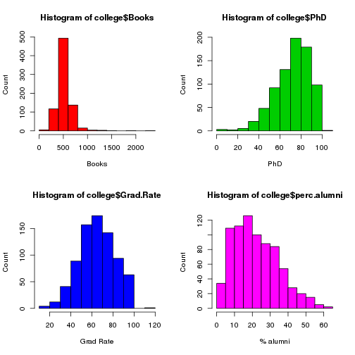
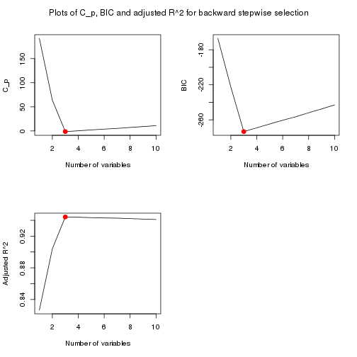
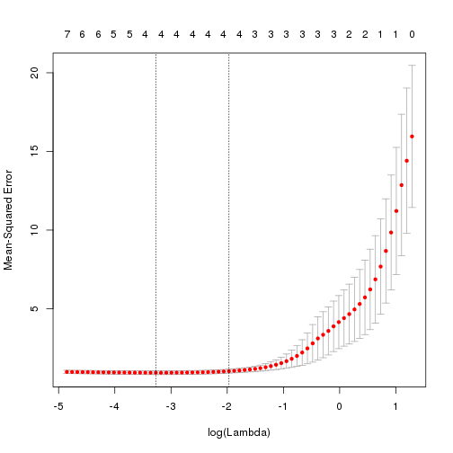
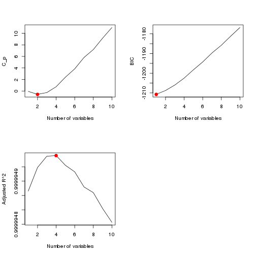
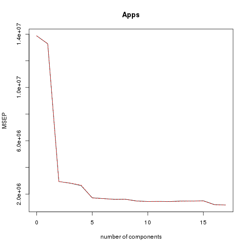
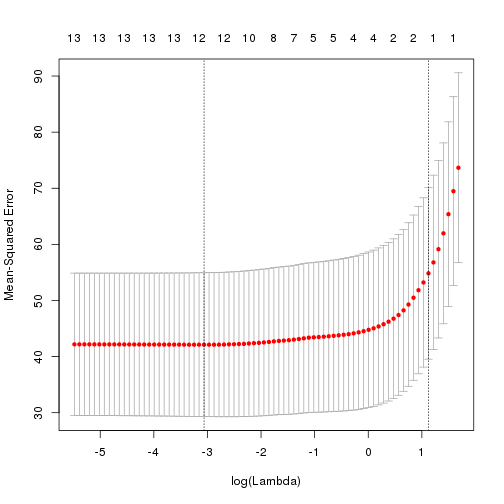
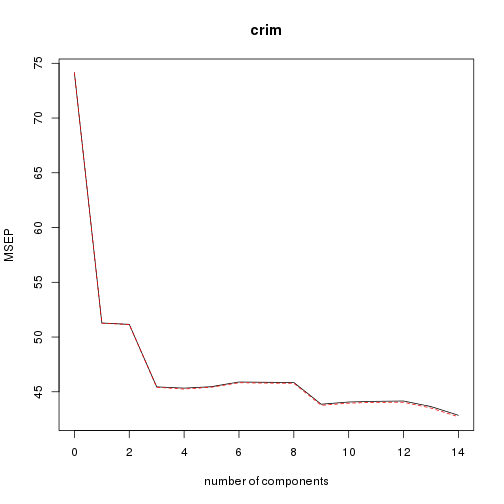

Solutions of the exercises from Chapter 6
============================================

## Conceptual

**Q1.** We perform best subset, forward stepwise, and backward stepwise selection on a single data set. For each approach, we obtain $p + 1$ models containing $0,1,2,cdots,p$ predictors. Explain your answers :

(a) Which of the three models with $k$ predictors has the smallest training RSS ?

*When performing best subset selection, the model with $k$ predictors is the model with the smallest RSS among all the $C_p^k$ models with $k$ predictors. When performing forward stepwise selection, the model with $k$ predictors is the model with the smallest RSS among the $p - k + 1$ models which augment the predictors in $\mathcal{M}_{k - 1}$ with one additional predictor. When performing backward stepwise selection, the model with $k$ predictors is the model with the smallest RSS among the $k + 1$ models which contains all but one of the predictors in $\mathcal{M}_{k + 1}$. So, the model with $k$ predictors which has the smallest training RSS is the one obtained from best subset selection as it is the one salected among all $k$ predictors models.*

(b) Which of the three models with $k$ predictors has the smallest test RSS ?

*Difficult to answer : best subset selection may have the smallest test RSS because it takes into account more models than the other methods. However, the other methods might also pick a model with smaller test RSS by sheer luck.*

(c) True or False :

i. The predictors in the $k$-variable model identified by forward stepwise are a subset of the predictors in the $(k + 1)$-variable model identified by forward stepwise selection.

*True. The model with $(k + 1)$ predictors is obtained by augmenting the predictors in the model with $k$ predictors with one additional predictor.*

ii. The predictors in the $k$-variable model identified by backward stepwise are a subset of the predictors in the $(k + 1)$-variable model identified by backward stepwise selection.

*True. The model with $k$ predictors is obtained by removing one predictor from the model with $(k + 1)$ predictors.*

iii. The predictors in the $k$-variable model identified by backward stepwise are a subset of the predictors in the $(k + 1)$-variable model identified by forward stepwise selection.

*False. There is no direct link between the models obtained from forward and backward selection.*

iv. The predictors in the $k$-variable model identified by forward stepwise are a subset of the predictors in the $(k + 1)$-variable model identified by backward stepwise selection.

*False. There is no direct link between the models obtained from forward and backward selection.*

v. The predictors in the $k$-variable model identified by best subset are a subset of the predictors in the $(k + 1)$-variable model identified by best subset selection.

*False. The model with $(k + 1)$ predictors is obtained by selecting among all possible models with $(k + 1)$ predictors, and so does not necessarily contain all the predictors selected for the $k$-variable model.*

**Q2.** For parts (a) through (c), indicate which of i. through iv. is correct. Justify your answer.

(a) The lasso, relative to least squares, is :

i. More flexible and hence will give improved prediction accuracy when its increase in bias is less than its decrease in variance.

*The lasso is less flexible and will give improved prediction accuracy when its increase in bias is less than its decrease in variance.*

(b) Repeat (a) for ridge regression relative to least squares.

*Same as lasso, ridge regression is less flexible and will give improved prediction accuracy when its increase in bias is less than its decrease in variance.*

(c) Repear (a) for non-linear methods relative to least squares.

*Non-linear methods are more flexible and will give improved prediction accuracy when their increase in variance are less than their decrease in bias.*

**Q3.** Suppose we estimate the regression coefficients in a linear regression model by minimizing
\[\sum_{i=1}^n\Biggl(y_i - \beta_0 - \sum_{j=1}^p\beta_jx_{ij}\Biggr)\text{ subject to }\sum_{j=1}^p|\beta_j|\le s\]
for a particular value of $s$. For parts (a) through (e), indicate which of i. through v. is correct. Justify your answer.

(a) As we increase $s$ from 0, the training RSS will :

*Steadily decrease. As we increase $s$ from 0, we are restricting the $\beta_j$ coefficients less and less (the coefficients will increase to their least squares estimates), and so the model is becoming more and more flexible which provokes a steady decrease in the training RSS.*

(b) Repeat (a) for test RSS.

*Increase initially, and then eventually start increasing in a U shape. As we increase $s$ from 0, we are restricting the $\beta_j$ coefficients less and less (the coefficients will increase to their least squares estimates), and so the model is becoming more and more flexible which provokes at first a decrease in the training RSS before increasing again after that in a typical U shape.*

(c) Repeat (a) for variance.

*Steadily increase. As we increase $s$ from 0, we are restricting the $\beta_j$ coefficients less and less (the coefficients will increase to their least squares estimates), and so the model is becoming more and more flexible which provokes a steady increase in variance.*

(d) Repeat (a) for (squared) bias.

*Steadily decrease. As we increase $s$ from 0, we are restricting the $\beta_j$ coefficients less and less (the coefficients will increase to their least squares estimates), and so the model is becoming more and more flexible which provokes a steady decrease in bias.*

(e) Repeat (a) for the irreducible error.

*Remain constant. By definition, the irreducible error is independant of the model, and consequently independant of the value of $s$.*

**Q4.** Suppose we estimate the regression coefficients in a linear regression model by minimizing
\[\sum_{i=1}^n\Biggl(y_i - \beta_0 - \sum_{j=1}^p\beta_jx_{ij}\Biggr) - \lambda\sum_{j=1}^p\beta_j^2\]
for a particular value of $\lambda$. For parts (a) through (e), indicate which of i. through v. is correct. Justify your answer.

(a) As we increase $\lambda$ from 0, the training RSS will

*Steadily increase. As we increase $\lambda$ from 0, we are restricting the $\beta_j$ coefficients more and more (the coefficients will deviate from their least squares estimates), and so the model is becoming less and less flexible which provokes a steady increase in training RSS.*

(b) Repeat (a) for test RSS.

*Decrease initially, and then eventually start increasing in a U shape. As we increase $\lambda$ from 0, we are restricting the $\beta_j$ coefficients more and more (the coefficients will deviate from their least squares estimates), and so the model is becoming less and less flexible which provokes at first a decrease in the test RSS before increasing again after that in a typical U shape.*

(c) Repeat (a) for variance.

*Steadily decrease. As we increase $\lambda$ from 0, we are restricting the $\beta_j$ coefficients more and more (the coefficients will deviate from their least squares estimates), and so the model is becoming less and less flexible which provokes a steady decrease in variance.*

(d) Repeat (a) for (squared) bias.

*Steadily increase. As we increase $\lambda$ from 0, we are restricting the $\beta_j$ coefficients more and more (the coefficients will deviate from their least squares estimates), and so the model is becoming less and less flexible which provokes a steady increase in bias.*

(e) Repeat (a) for the irreducible error.

*Remain constant. By definition, the irreducible error is independant of the model, and consequently independant of the value of $\lambda$.*

**Q5.** It is well-known that ridge regression tends to give similar coefficient values to correlated variables, whereas the lasso may give different coefficient values to correlated variables. We will now explore this property in a very simple setting.

Suppose that $n = 2$, $p = 2$, $x_{11} = x_{12}$, $x_{21} = x_{22}$. Furthermore, suppose that $y_1 + y_2 = 0$ and $x_{11} + x_{21} = 0$ and $x_{12} + x_{22} = 0$, so that the estimate for the intercept in a least squares, ridge regression, or lasso model is zero : $\hat{\beta}_0 = 0$.

(a) Write out the ridge regression optimization problem in this setting.

*According to this setting ($x_{11} = x_{12} = x_1$ and $x_{21} = x_{22} = x_2$), the ridge regression problem seeks to minimize
\[(y_1 - \hat{\beta}_1x_1 - \hat{\beta}_2x_1)^2 + (y_1 - \hat{\beta}_1x_2 - \hat{\beta}_2x_2)^2 + \lambda(\hat{\beta}_1^2 + \hat{\beta}_2^2).\]*

(b) Argue that in this setting, the ridge coefficient estimates satisfy $\hat{\beta}_1 = \hat{\beta}_2$.

*By taking the derivatives of the above expression with respect to $\hat{\beta}_1$ and $\hat{\beta}_2$, we obtain respectively
\[\hat{\beta}_1(x_1^2 + x_2^2 + \lambda) + \hat{\beta}_2(x_1^2 + x_2^2) = y_1x_1 + y_2x_2\]
and
\[\hat{\beta}_1(x_1^2 + x_2^2) + \hat{\beta}_2(x_1^2 + x_2^2 + \lambda) = y_1x_1 + y_2x_2.\]
By substracting the two expressions above we get $\hat{\beta}_1 = \hat{\beta}_2$.*

(c) Write out the lasso optimization problem in this setting.

*According to this setting ($x_{11} = x_{12} = x_1$ and $x_{21} = x_{22} = x_2$), the lasso optimization problem seeks to minimize
\[(y_1 - \hat{\beta}_1x_1 - \hat{\beta}_2x_1)^2 + (y_2 - \hat{\beta}_1x_2 - \hat{\beta}_2x_2)^2 + \lambda(|\hat{\beta}_1| + |\hat{\beta}_2|).\]*

(d) Argue that in this setting, the lasso coefficients $\hat{\beta}_1$ and $\hat{\beta}_2$ are not unique; in other words, there are many possible solutions to the optimization problem in (c). Describe these solutions.

*We will use the alternate form of the lasso optimization problem
\[(y_1 - \hat{\beta}_1x_1 - \hat{\beta}_2x_1)^2 + (y_2 - \hat{\beta}_1x_2 - \hat{\beta}_2x_2)^2\text{ subject to }|\hat{\beta}_1| + |\hat{\beta}_2|\le s.\]
Geometrically the lasso constraint take the form of a diamond centered at the origin of the plane $(\hat{\beta}_1,\hat{\beta}_2)$ which intersects the axes at a distance $s$ from the origin. By using the setting of this problem ($x_{11} = x_{12} = x_1$, $x_{21} = x_{22} = x_2$, $x_1 + x_2 = 0$ and $y_1 + y_2 = 0$), we have to minimize the exression
\[2[y_1 - (\hat{\beta}_1 + \hat{\beta}_2)x_1]^2\ge 0.\]
This optimization problem has a simple solution : $\hat{\beta}_1 + \hat{\beta}_2 = y_1/x_1$. Geometrically, this is a line parallel to the edge of the diamond of the constraints. Now, solutions to the lasso optimization problem are contours of the function $[y_1 - (\hat{\beta}_1 + \hat{\beta}_2)x_1]^2$ that intersects the diamond of the constraints. So, the entire edge $\hat{\beta}_1 + \hat{\beta}_2 = s$ (as is the edge $\hat{\beta}_1 + \hat{\beta}_2 = -s$) is a potential solution to the lasso optimization problem. Thus, the lasso optimization problem has a whole set of solutions instead of a unique one :
\[\{(\hat{\beta}_1,\hat{\beta}_2) : \hat{\beta}_1 + \hat{\beta}_2 = s\text{ with }\hat{\beta}_1,\hat{\beta}_2\ge 0\text{ and }\hat{\beta}_1 + \hat{\beta}_2 = -s\text{ with }\hat{\beta}_1,\hat{\beta}_2\le 0\}.\]*

**Q6.** We will now explore (6.12) and (6.13) further.

(a) Consider (6.12) with $p = 1$. For some choice of $y_1$ and $\lambda > 0$, plot (6.12) as a function of $\beta_1$. Your plot should confirm that (6.12) is solved by (6.14).


```r
y <- 3
lambda <- 2
beta <- seq(-10, 10, 0.1)
plot(beta, (y - beta)^2 + lambda * beta^2, pch = 20, xlab = "beta", ylab = "Ridge optimization")
beta.est <- y / (1 + lambda)
points(beta.est, (y - beta.est)^2 + lambda * beta.est^2, col = "red", pch = 4, lwd = 5)
```

 

*We may see that the function is minimized at $\beta = y / (1 + \lambda)$.*

(b) Consider (6.13) with $p = 1$. For some choice of $y_1$ and $\lambda > 0$, plot (6.13) as a function of $\beta_1$. Your plot should confirm that (6.13) is solved by (6.15).


```r
y <- 3
lambda <- 2
beta <- seq(-10, 10, 0.1)
plot(beta, (y - beta)^2 + lambda * abs(beta), pch = 20, xlab = "beta", ylab = "Lasso optimization")
beta.est <- y - lambda / 2
points(beta.est, (y - beta.est)^2 + lambda * abs(beta.est), col = "red", pch = 4, lwd = 5)
```

 

*We may see that the function is minimized at $\beta = y - \lambda/2$ as $y > \lambda / 2$.*

## Applied

**Q8.** In this exercise, we will generate simulated data, and will then use this data to perform best subset selection.

(a) Use the rnorm() function to generate a predictor $X$ of length $n = 100$, as well as a noise vector $\varepsilon$ of length $n = 100$.


```r
set.seed(1)
x <- rnorm(100)
eps <- rnorm(100)
```

(b) Generate a response vector $Y$ of length $n = 100$ according to the model
\[Y = \beta_0 + \beta_1X + \beta_2X^2 + \beta_3X^3 + \varepsilon\]
where $\beta_0$, $\beta_1$, $\beta_2$ and $\beta_3$ are constants of your choice.


```r
b0 <- 2
b1 <- 3
b2 <- -1
b3 <- 0.5
y <- b0 + b1 * x + b2 * x^2 + b3 * x^3 + eps
```

(c) Use the regsubsets() function to perform best subset selection in order to choose the best model containing the predictors $X,X^2,\cdots,X^{10}$. What is the best model obtained according to $C_p$, BIC, and adjusted $R^2$ ? Show some plots to provide evidence for your answer, and report the coefficients of the best model obtained. Note you will need to use the data.frame() function to create a single data set containing both $X$ and $Y$.


```r
library(leaps)
data.full <- data.frame(y = y, x = x)
regfit.full <- regsubsets(y ~ x + I(x^2) + I(x^3) + I(x^4) + I(x^5) + I(x^6) + I(x^7) + I(x^8) + I(x^9) + I(x^10), data = data.full, nvmax = 10)
reg.summary <- summary(regfit.full)
par(mfrow = c(2, 2))
plot(reg.summary$cp, xlab = "Number of variables", ylab = "C_p", type = "l")
points(which.min(reg.summary$cp), reg.summary$cp[which.min(reg.summary$cp)], col = "red", cex = 2, pch = 20)
plot(reg.summary$bic, xlab = "Number of variables", ylab = "BIC", type = "l")
points(which.min(reg.summary$bic), reg.summary$bic[which.min(reg.summary$bic)], col = "red", cex = 2, pch = 20)
plot(reg.summary$adjr2, xlab = "Number of variables", ylab = "Adjusted R^2", type = "l")
points(which.max(reg.summary$adjr2), reg.summary$adjr2[which.max(reg.summary$adjr2)], col = "red", cex = 2, pch = 20)
```

 

*We find that, with $C_p$ we pick the 3-variables model, with BIC we pick the 3-variables model, and with adjusted $R^2$ we pick the 3-variables model.*


```r
coef(regfit.full, which.max(reg.summary$adjr2))
```

```
## (Intercept)           x      I(x^2)      I(x^5) 
##     2.07219     3.44515    -1.15676     0.09023
```

(d) Repeat (c), using forward stepwise selection and also using backwards stepwise selection. How does your answer compare to the results in (c) ?

*We begin with forward stepwise selection.*


```r
regfit.fwd <- regsubsets(y ~ x + I(x^2) + I(x^3) + I(x^4) + I(x^5) + I(x^6) + I(x^7) + I(x^8) + I(x^9) + I(x^10), data = data.full, nvmax = 10, method = "forward")
reg.summary.fwd <- summary(regfit.fwd)
par(mfrow = c(2, 2))
plot(reg.summary.fwd$cp, xlab = "Number of variables", ylab = "C_p", type = "l")
points(which.min(reg.summary.fwd$cp), reg.summary.fwd$cp[which.min(reg.summary.fwd$cp)], col = "red", cex = 2, pch = 20)
plot(reg.summary.fwd$bic, xlab = "Number of variables", ylab = "BIC", type = "l")
points(which.min(reg.summary.fwd$bic), reg.summary.fwd$bic[which.min(reg.summary.fwd$bic)], col = "red", cex = 2, pch = 20)
plot(reg.summary.fwd$adjr2, xlab = "Number of variables", ylab = "Adjusted R^2", type = "l")
points(which.max(reg.summary.fwd$adjr2), reg.summary.fwd$adjr2[which.max(reg.summary.fwd$adjr2)], col = "red", cex = 2, pch = 20)
mtext("Plots of C_p, BIC and adjusted R^2 for forward stepwise selection", side = 3, line = -2, outer = TRUE)
```

 

*We find that, for forward stepwise selection, with $C_p$ we pick the 3-variables model, with BIC we pick the 3-variables model, and with adjusted $R^2$ we pick the 3-variables model.*


```r
coef(regfit.fwd, which.max(reg.summary.fwd$adjr2))
```

```
## (Intercept)           x      I(x^2)      I(x^5) 
##     2.07219     3.44515    -1.15676     0.09023
```

*Next we proceed with backward stepwise selection.*


```r
regfit.bwd <- regsubsets(y ~ x + I(x^2) + I(x^3) + I(x^4) + I(x^5) + I(x^6) + I(x^7) + I(x^8) + I(x^9) + I(x^10), data = data.full, nvmax = 10, method = "backward")
reg.summary.bwd <- summary(regfit.bwd)
par(mfrow = c(2, 2))
plot(reg.summary.bwd$cp, xlab = "Number of variables", ylab = "C_p", type = "l")
points(which.min(reg.summary.bwd$cp), reg.summary.bwd$cp[which.min(reg.summary.bwd$cp)], col = "red", cex = 2, pch = 20)
plot(reg.summary.bwd$bic, xlab = "Number of variables", ylab = "BIC", type = "l")
points(which.min(reg.summary.bwd$bic), reg.summary.bwd$bic[which.min(reg.summary.bwd$bic)], col = "red", cex = 2, pch = 20)
plot(reg.summary.bwd$adjr2, xlab = "Number of variables", ylab = "Adjusted R^2", type = "l")
points(which.max(reg.summary.bwd$adjr2), reg.summary.bwd$adjr2[which.max(reg.summary.bwd$adjr2)], col = "red", cex = 2, pch = 20)
mtext("Plots of C_p, BIC and adjusted R^2 for backward stepwise selection", side = 3, line = -2, outer = TRUE)
```

 

*We find that, for backward stepwise selection, with $C_p$ we pick the 3-variables model, with BIC we pick the 3-variables model, and with adjusted $R^2$ we pick the 3-variables model.*


```r
coef(regfit.bwd, which.max(reg.summary.bwd$adjr2))
```

```
## (Intercept)           x      I(x^2)      I(x^5) 
##     2.07219     3.44515    -1.15676     0.09023
```

*Here forward stepwise, backward stepwise and best subset all select the three variables model with $X$, $X^2$ and $X^5$.*

(e) Now fit a lasso model to the simulated data, again using $X,X^2,\cdots,X^{10}$ as predictors. Use cross-validation to select the optimal value of $\lambda$. Create plots of the cross-validation error as a function of $\lambda$. Report the resulting coefficient estimates, and discuss the results obtained.


```r
library(glmnet)
xmat <- model.matrix(y ~ x + I(x^2) + I(x^3) + I(x^4) + I(x^5) + I(x^6) + I(x^7) + I(x^8) + I(x^9) + I(x^10), data = data.full)[, -1]
cv.lasso <- cv.glmnet(xmat, y, alpha = 1)
plot(cv.lasso)
```

 

```r
bestlam <- cv.lasso$lambda.min
bestlam
```

```
## [1] 0.03796
```

*Now we refit our lasso model using the value $\lambda =$ 0.038 chosen by cross-validation.*


```r
fit.lasso <- glmnet(xmat, y, alpha = 1)
predict(fit.lasso, s = bestlam, type = "coefficients")[1:11, ]
```

```
## (Intercept)           x      I(x^2)      I(x^3)      I(x^4)      I(x^5) 
##     2.04091     3.28373    -1.10647     0.14042     0.00000     0.06399 
##      I(x^6)      I(x^7)      I(x^8)      I(x^9)     I(x^10) 
##     0.00000     0.00000     0.00000     0.00000     0.00000
```

*The lasso method picks $X$, $X^2$, $X^3$ and $X^5$ as variables for the model.*

(f) Now generate a response vector $Y$ according to the model
\[Y = \beta_0 + \beta_7X^7 + \varepsilon,\]
and perform best subset selection and the lasso. Discuss the results obtained.

*We begin with best subset selection.*


```r
b7 <- 7
y <- b0 + b7 * x^7 + eps
data.full <- data.frame(y = y, x = x)
regfit.full <- regsubsets(y ~ x + I(x^2) + I(x^3) + I(x^4) + I(x^5) + I(x^6) + I(x^7) + I(x^8) + I(x^9) + I(x^10), data = data.full, nvmax = 10)
reg.summary <- summary(regfit.full)
par(mfrow = c(2, 2))
plot(reg.summary$cp, xlab = "Number of variables", ylab = "C_p", type = "l")
points(which.min(reg.summary$cp), reg.summary$cp[which.min(reg.summary$cp)], col = "red", cex = 2, pch = 20)
plot(reg.summary$bic, xlab = "Number of variables", ylab = "BIC", type = "l")
points(which.min(reg.summary$bic), reg.summary$bic[which.min(reg.summary$bic)], col = "red", cex = 2, pch = 20)
plot(reg.summary$adjr2, xlab = "Number of variables", ylab = "Adjusted R^2", type = "l")
points(which.max(reg.summary$adjr2), reg.summary$adjr2[which.max(reg.summary$adjr2)], col = "red", cex = 2, pch = 20)
```

 

*We find that, with $C_p$ we pick the 2-variables model, with BIC we pick the 1-variables model, and with adjusted $R^2$ we pick the 4-variables model.*


```r
coef(regfit.full, 1)
```

```
## (Intercept)      I(x^7) 
##       1.959       7.001
```

```r
coef(regfit.full, 2)
```

```
## (Intercept)      I(x^2)      I(x^7) 
##      2.0705     -0.1417      7.0016
```

```r
coef(regfit.full, 4)
```

```
## (Intercept)           x      I(x^2)      I(x^3)      I(x^7) 
##      2.0763      0.2914     -0.1618     -0.2527      7.0091
```

*Here best subset selection with BIC picks the most accurate 1-variable model with matching coefficients.*

*Now we proceed with the lasso.*


```r
xmat <- model.matrix(y ~ x + I(x^2) + I(x^3) + I(x^4) + I(x^5) + I(x^6) + I(x^7) + I(x^8) + I(x^9) + I(x^10), data = data.full)[, -1]
cv.lasso <- cv.glmnet(xmat, y, alpha = 1)
bestlam <- cv.lasso$lambda.min
bestlam
```

```
## [1] 12.37
```

```r
fit.lasso <- glmnet(xmat, y, alpha = 1)
predict(fit.lasso, s = bestlam, type = "coefficients")[1:11, ]
```

```
## (Intercept)           x      I(x^2)      I(x^3)      I(x^4)      I(x^5) 
##       2.820       0.000       0.000       0.000       0.000       0.000 
##      I(x^6)      I(x^7)      I(x^8)      I(x^9)     I(x^10) 
##       0.000       6.797       0.000       0.000       0.000
```

*Here the lasso also picks the most accurate 1-variable model, but the intercept is quite off.*

**Q9.** In this exercise, we will predict the number of applications received using the other variables in the "College" data set.

(a) Split the data set into a training and a test set.


```r
set.seed(11)
train = sample(1:dim(College)[1], dim(College)[1] / 2)
test <- -train
College.train <- College[train, ]
College.test <- College[test, ]
```

(b) Fit a linear model using least squares on the training set, and report the test error obtained.


```r
fit.lm <- lm(Apps ~ ., data = College.train)
pred.lm <- predict(fit.lm, College.test)
mean((pred.lm - College.test$Apps)^2)
```

```
## [1] 1538442
```

*The test MSE is 1.5384 &times; 10<sup>6</sup>.*

(c) Fit a ridge regression model on the training set, with $\lambda$ chosen by cross-validation. Report the test error obtained.


```r
train.mat <- model.matrix(Apps ~ ., data = College.train)
test.mat <- model.matrix(Apps ~ ., data = College.test)
grid <- 10 ^ seq(4, -2, length = 100)
fit.ridge <- glmnet(train.mat, College.train$Apps, alpha = 0, lambda = grid, thresh = 1e-12)
cv.ridge <- cv.glmnet(train.mat, College.train$Apps, alpha = 0, lambda = grid, thresh = 1e-12)
bestlam.ridge <- cv.ridge$lambda.min
bestlam.ridge
```

```
## [1] 18.74
```

```r
pred.ridge <- predict(fit.ridge, s = bestlam.ridge, newx = test.mat)
mean((pred.ridge - College.test$Apps)^2)
```

```
## [1] 1608859
```

*The test MSE is higher for ridge regression than for least squares.*

(d) Fit a lasso model on the training set, with $\lambda$ chosen by cross-validation. Report the test error obtained, along with the number of non-zero coefficient estimates.


```r
fit.lasso <- glmnet(train.mat, College.train$Apps, alpha = 1, lambda = grid, thresh = 1e-12)
cv.lasso <- cv.glmnet(train.mat, College.train$Apps, alpha = 1, lambda = grid, thresh = 1e-12)
bestlam.lasso <- cv.lasso$lambda.min
bestlam.lasso
```

```
## [1] 21.54
```

```r
pred.lasso <- predict(fit.lasso, s = bestlam.lasso, newx = test.mat)
mean((pred.lasso - College.test$Apps)^2)
```

```
## [1] 1635280
```

*The test MSE is also higher for ridge regression than for least squares.*


```r
predict(fit.lasso, s = bestlam.lasso, type = "coefficients")
```

```
## 19 x 1 sparse Matrix of class "dgCMatrix"
##                      1
## (Intercept) -836.50402
## (Intercept)    .      
## PrivateYes  -385.73749
## Accept         1.17935
## Enroll         .      
## Top10perc     22.70212
## Top25perc      .      
## F.Undergrad    0.07062
## P.Undergrad    0.01367
## Outstate      -0.03425
## Room.Board     0.01282
## Books         -0.02168
## Personal       .      
## PhD           -1.46397
## Terminal      -5.17281
## S.F.Ratio      5.70970
## perc.alumni   -9.95008
## Expend         0.14853
## Grad.Rate      5.79790
```

(e) Fit a PCR model on the training set, with $M$ chosen by cross-validation. Report the test error obtained, along with the value of $M$ selected by cross-validation.


```r
library(pls)
fit.pcr <- pcr(Apps ~ ., data = College.train, scale = TRUE, validation = "CV")
validationplot(fit.pcr, val.type = "MSEP")
```

 

```r
pred.pcr <- predict(fit.pcr, College.test, ncomp = 10)
mean((pred.pcr - College.test$Apps)^2)
```

```
## [1] 3014496
```

*The test MSE is also higher for PCR than for least squares.*

(f) Fit a PLS model on the training set, with $M$ chosen by cross-validation. Report the test error obtained, along with the value of $M$ selected by cross-validation.


```r
fit.pls <- plsr(Apps ~ ., data = College.train, scale = TRUE, validation = "CV")
validationplot(fit.pls, val.type = "MSEP")
```

 

```r
pred.pls <- predict(fit.pls, College.test, ncomp = 10)
mean((pred.pls - College.test$Apps)^2)
```

```
## [1] 1508987
```

*Here, the test MSE is lower for PLS than for least squares.*

(g) Comment on the results obtained. How accurately can we predict the number of college applications received ? Is there much difference among the test errors resulting from these five approaches ?

*To compare the results obtained above, we have to compute the test $R^2$ for all models.*


```r
test.avg <- mean(College.test$Apps)
lm.r2 <- 1 - mean((pred.lm - College.test$Apps)^2) / mean((test.avg - College.test$Apps)^2)
ridge.r2 <- 1 - mean((pred.ridge - College.test$Apps)^2) / mean((test.avg - College.test$Apps)^2)
lasso.r2 <- 1 - mean((pred.lasso - College.test$Apps)^2) / mean((test.avg - College.test$Apps)^2)
pcr.r2 <- 1 - mean((pred.pcr - College.test$Apps)^2) / mean((test.avg - College.test$Apps)^2)
pls.r2 <- 1 - mean((pred.pls - College.test$Apps)^2) / mean((test.avg - College.test$Apps)^2)
```

*So the test $R^2$ for least squares is 0.9044, the test $R^2$ for ridge is 0.9001, the test $R^2$ for lasso is 0.8984, the test $R^2$ for pcr is 0.8127 and the test $R^2$ for pls is 0.9063. All models, except PCR, predict college applications with high accuracy.*

**Q10.** We have seen that as a number of features used in a model increases, the training error will ncessarily decrease, but the test error may not. We will now explore this in a simulated data set.

(a) Generate a data set with $p = 20$ features, $n = 1000$ observations, and an associated quantitative response vector generated according to the model
\[Y = X\beta + \epsilon,\]
where $\beta$ has some elements that are exactly equal to zero.


```r
set.seed(1)
x <- matrix(rnorm(1000 * 20), 1000, 20)
b <- rnorm(20)
b[3] <- 0
b[4] <- 0
b[9] <- 0
b[19] <- 0
b[10] <- 0
eps <- rnorm(1000)
y <- x %*% b + eps
```

(b) Split your data set into a training set containing 100 observations and a test set containing 900 observations.


```r
train <- sample(seq(1000), 100, replace = FALSE)
test <- -train
x.train <- x[train, ]
x.test <- x[test, ]
y.train <- y[train]
y.test <- y[test]
```

(c) Perform best subset selection on the training set, and plot the training set MSE associated with the best model of each size.


```r
data.train <- data.frame(y = y.train, x = x.train)
regfit.full <- regsubsets(y ~ ., data = data.train, nvmax = 20)
train.mat <- model.matrix(y ~ ., data = data.train, nvmax = 20)
val.errors <- rep(NA, 20)
for (i in 1:20) {
    coefi <- coef(regfit.full, id = i)
    pred <- train.mat[, names(coefi)] %*% coefi
    val.errors[i] <- mean((pred - y.train)^2)
}
plot(val.errors, xlab = "Number of predictors", ylab = "Training MSE", pch = 19, type = "b")
```

 

(d) Plot the test MSE associated with the best model of each size.


```r
data.test <- data.frame(y = y.test, x = x.test)
test.mat <- model.matrix(y ~ ., data = data.test, nvmax = 20)
val.errors <- rep(NA, 20)
for (i in 1:20) {
    coefi <- coef(regfit.full, id = i)
    pred <- test.mat[, names(coefi)] %*% coefi
    val.errors[i] <- mean((pred - y.test)^2)
}
plot(val.errors, xlab = "Number of predictors", ylab = "Test MSE", pch = 19, type = "b")
```

 

(e) For which model size does the test set MSE take on its minimum value ? Comment on your results. It it takes on its minimum value for a model containing only an intercept or a model containing all the features, then play around with the way that you are generating the data in (a) until you come up with a scenario in which the test MSE is minimized for an intermediate model size.


```r
which.min(val.errors)
```

```
## [1] 14
```

*The 14-variables model has the smallest test MSE.*

(f) How does the model at which the test set MSE is minimized compare to the true model used to generate the data ? Comment on the coefficient values.


```r
coef(regfit.full, which.min(val.errors))
```

```
## (Intercept)         x.1         x.2         x.5         x.7         x.8 
##      0.1631      0.3708      0.3177      1.0424     -1.2896      0.8309 
##        x.11        x.12        x.13        x.14        x.15        x.16 
##      0.6919      0.5639     -0.3641     -0.8346     -0.5668     -0.1960 
##        x.17        x.18        x.20 
##      0.3128      1.5567     -0.7832
```

*The best model caught all zeroed out coefficients.*

(g) Create a plot displaying
\[\sqrt{\sum_{j=1}^p(\beta_j - \hat{\beta}_j^r)^2}\]
for a range of values of $r$ where $\hat{\beta}_j^r$ is the jth coefficient estimate for the best model containing $r$ coefficients. Comment on what you observe. How does this compare to the test MSE plot from (d) ?


```r
val.errors <- rep(NA, 20)
x_cols = colnames(x, do.NULL = FALSE, prefix = "x.")
for (i in 1:20) {
    coefi <- coef(regfit.full, id = i)
    val.errors[i] <- sqrt(sum((b[x_cols %in% names(coefi)] - coefi[names(coefi) %in% x_cols])^2) + sum(b[!(x_cols %in% names(coefi))])^2)
}
plot(val.errors, xlab = "Number of coefficients", ylab = "Error between estimated and true coefficients", pch = 19, type = "b")
```

 

*We may see that the model with 3 variables minimizes the error between the estimated and true coefficients. However test error is minimized by the model with 14 variables. So, a better fit of true coefficients doesn't necessarily mean a lower test MSE.*

**Q11.** We will now try to predict per capita crime rate in the "Boston" data set.

(a) Try out some of the regression methods explored in this chapter, such as best subset selection, the lasso, ridge regression and PCR. Present and discuss results for the approaches that you consider.

*we begin with best subset selection.*


```r
library(MASS)
set.seed(1)

predict.regsubsets <- function(object, newdata, id, ...) {
    form <- as.formula(object$call[[2]])
    mat <- model.matrix(form, newdata)
    coefi <- coef(object, id = id)
    xvars <- names(coefi)
    mat[, xvars] %*% coefi
}

k = 10
folds <- sample(1:k, nrow(Boston), replace = TRUE)
cv.errors <- matrix(NA, k, 14, dimnames = list(NULL, paste(1:14)))
for (j in 1:k) {
    best.fit <- regsubsets(crim ~ ., data = Boston[folds != j, ], nvmax = 14)
    for (i in 1:14) {
        pred <- predict(best.fit, Boston[folds == j, ], id = i)
        cv.errors[j, i] <- mean((Boston$crim[folds == j] - pred)^2)
    }
}
mean.cv.errors <- apply(cv.errors, 2, mean)
plot(mean.cv.errors, type = "b", xlab = "Number of variables", ylab = "CV error")
```

 

*We may see that cross-validation selects an 13-variables model. We have a CV estimate for the test MSE equal to 41.0336.*

*Next we proceed with the lasso.*


```r
x <- model.matrix(crim ~ ., Boston)[, -1]
y <- Boston$crim
cv.out <- cv.glmnet(x, y, alpha = 1, type.measure = "mse")
plot(cv.out)
```

 

*Here cross-validation selects a $\lambda$ equal to 0.0467. We have a CV estimate for the test MSE equal to 42.129.*

*Next we proceed with ridge regression.*


```r
cv.out <- cv.glmnet(x, y, alpha = 0, type.measure = "mse")
plot(cv.out)
```

 

*Here cross-validation selects a $\lambda$ equal to 0.5375. We have a CV estimate for the test MSE equal to 42.9819.*

*Finally, we proceed with PCR.*


```r
pcr.fit <- pcr(crim ~ ., data = Boston, scale = TRUE, validation = "CV")
summary(pcr.fit)
```

```
## Data: 	X dimension: 506 14 
## 	Y dimension: 506 1
## Fit method: svdpc
## Number of components considered: 14
## 
## VALIDATION: RMSEP
## Cross-validated using 10 random segments.
##        (Intercept)  1 comps  2 comps  3 comps  4 comps  5 comps  6 comps
## CV            8.61    7.161    7.153    6.742    6.733    6.743    6.775
## adjCV         8.61    7.160    7.151    6.739    6.727    6.740    6.770
##        7 comps  8 comps  9 comps  10 comps  11 comps  12 comps  13 comps
## CV       6.773    6.771    6.623     6.638     6.643     6.645     6.607
## adjCV    6.767    6.766    6.616     6.631     6.636     6.637     6.597
##        14 comps
## CV        6.546
## adjCV     6.536
## 
## TRAINING: % variance explained
##       1 comps  2 comps  3 comps  4 comps  5 comps  6 comps  7 comps
## X       47.96    60.43    69.18    75.49    81.57    86.27    89.22
## crim    30.87    31.10    39.09    39.52    39.52    39.68    39.80
##       8 comps  9 comps  10 comps  11 comps  12 comps  13 comps  14 comps
## X       91.95    94.05     95.86     97.35     98.66     99.56    100.00
## crim    39.97    42.72     42.81     42.89     43.23     44.23     45.43
```

```r
validationplot(pcr.fit, val.type = "MSEP")
```

 

*Here cross-validation selects $M$ to be equal to 14 (so, no dimension reduction). We have a CV estimate for the test MSE equal to 45.8266.*

(b) Propose a model (or set of models) that seem to perform well on this data set, and justify your answer. Make sure that you are evaluating model performance using validation set error, cross-validation, or some other reasonable alternative, as opposed to using training error.

*As computed above the model with the lower cross-validation error is the one chosen by the best subset selection method.*

(c) Does your chosen model involve all of the features in the data set ? Why or why not ?

*No, the model chosen by the best subset selection method has only 13 predictors.*
